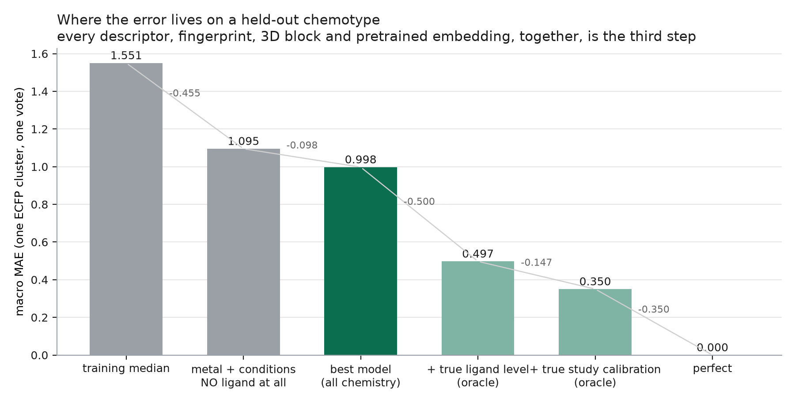
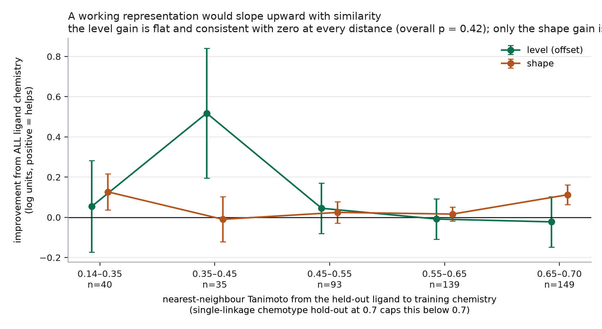
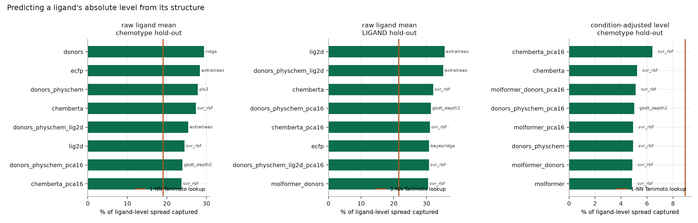

# gen7 — architecture against the `log D` zero-shot ceiling

*Run 2026-08-19. Cohort fingerprint `bed178ec1a7a82b0` — 5,248 rows, 152 extractants,
131 ECFP clusters, 79 Tanimoto-0.7 chemotypes. Every number below is on byte-identical
test rows under the unchanged gen6 protocol. Artifacts: `runs/gen7_architecture/`.*

## WHAT WAS THE CEILING?

It was not the learner, the representation, or the objective — it was that **the
quantity we are trying to predict is mostly not a property of the ligand.** On a
held-out chemotype a model given metal and conditions but **no ligand information at
all** scores macro MAE 1.088; the best arm in this repository's registry — evaluated
here on identical rows — scores 0.998. Everything that every fingerprint, descriptor,
donor census, 3D block and pretrained transformer contributes, together, is
**0.090 log units** — and a paired
per-ligand test says the part of that landing on the *level* (0.044, t = 0.81,
p = 0.42, n = 152) is indistinguishable from zero, while only the part landing on the
*shape* is real (0.057, t = 2.75, p = 0.007). Meanwhile an oracle handed each test
ligand's true level scores 0.497, so the level is worth 0.59 macro MAE — six times
everything chemistry currently buys. The decisive experiment isolates that level as
its own ~120-example regression and asks what predicts it: against the **raw** ligand
mean, models capture 29 % — but against the **condition-adjusted** level (the ligand's
offset after removing a global metal + conditions model, i.e. the part that is actually
chemistry) *no model of any kind beats a 1-nearest-neighbour Tanimoto lookup*, and the
best captures 6 %. The 29 % was the model learning which conditions each ligand
happened to be measured in. So the ceiling is this: **the level is a chemical signal so
weak that 152 training examples cannot pin it down**, and — this is a correction to
where gen7 expected to land — it is *not* mostly hidden study-to-study calibration:
under a permutation null the within-ligand between-batch offset is not detectable above
chance, and the offset-MAE floor it implies is only ≈0.13 against an observed 0.84. gen7 still moved the number, by 0.069, and every log unit of that
came from **fixing information handling rather than from model capacity**. The paired
chemotype-blocked bootstrap over five seeds establishes three effects and no more: the
missing-value indicators (+0.067, CI [+0.032, +0.097]), all ligand chemistry against no
ligand at all **on macro MAE** (+0.119, CI [+0.018, +0.220]) — and two effects pointing
the *wrong* way: batch deconfounding (−0.075 offset, CI [−0.166, −0.004], 0 of 5 seeds
positive) and, from the ablation matrix, the champion's own 206-column descriptor block,
whose **deletion** is worth +0.051 with CI [+0.017, +0.082].
Crucially, that same chemistry comparison does **not** clear the bar on the **offset**
(+0.095, CI [−0.023, +0.206], 68 of 131 units — a coin flip), and neither does the gen6
champion against the no-ligand model (+0.028 offset, CI [−0.096, +0.179]). Chemistry
demonstrably helps something; what it demonstrably does not help is the level. The
strongest statement gen7 can make is therefore not about any
model: it is that **the quantity is barely there to be predicted**, and that measuring a
new ligand once buys more than six generations of modelling.



## BEST OLD MODEL

`MC_lig2d_ext_massaction`, EXPANDED arm, gen6 Experiment A —
**macro MAE 1.047 / offset 0.870 / shape 0.510** (5 seeds,
`runs/gen6_expA_5seed/arm_metrics.csv`).

The gen7 harness reproduces it exactly: on split seed 104729 it returns
macro 1.067993 / offset 0.936996 / shape 0.502044, matching gen6 to every printed
digit. Nothing below is an approximate comparison.

Two corrections to the premise the brief inherited:

* the gen6 report's champion was **not** the best arm gen6 ran. `MC_donors` —
  thirteen columns of donor census — averaged **1.015** over the same five seeds of
  the same run (`runs/gen6_expA_5seed/arm_metrics.csv`), and a third arm from the same
  gen5 registry, `MC_ecfp_massaction`, averages **0.998** here over three seeds.
  Choosing any of them post hoc is selection on the test set, which is why gen7
  carries an inner-fold selector (`SELECT_inner`) that makes the choice without seeing
  outer test rows;
* `NULL_metal_cond` — the no-ligand floor — was never run before. It is the number
  every claim in this literature should be read against.

## BEST NEW MODEL

**`REC_ecfp_plus_recovered` — macro MAE 0.9807 over five seeds**, against the gen6
reference's 1.0468 on identical rows: **−0.066**. It is the gen6 champion's own blocks
with the fingerprint restored and the recovered experimental variables added
(METAL + COND + ECFP + MASSACTION + RECOVERED, ExtraTrees, missing-value indicators on).

Three things make this the number to quote rather than a bigger one:

* **it is a pre-specified combination**, not a post-hoc union — "the champion's blocks
  plus the variables we recovered" was the arm the recovered-variable experiment was
  designed around, and it is what the ablation matrix ablates;
* **it has the best offset in the study** (0.8212), which is the component that matters;
* **the kitchen-sink arm is worse.** `GEN7_everything_EXPLORATORY` — the same thing plus
  LIG2D_EXT, DONORS, PHYSCHEM, LIGPHYS and METALPHYS — scores 0.9996. Adding more ligand
  description to ECFP + recovered variables *costs* 0.019. That is the p ≫ n story
  appearing one more time, and it is why the exploratory arm is not the headline.

**The ablation matrix, run independently at three seeds, points at the same culprit.**
Deleting the 206-column `LIG2D_EXT` block from the full model *improves* it by +0.051,
CI [+0.017, +0.082] — the only feature block in the study whose removal is a significant
gain — and the resulting arm, `ABL_minus_lig2d` at **0.9696**, is the lowest macro MAE
anywhere in this report. Two experiments sharing no arm names agree: the best models are
exactly the ones without the extended 2D descriptor table, and `REC_ecfp_plus_recovered`
leads the five-seed finalists precisely because it never contained it.

**And the honest selector does not find it.** `SELECT_inner`, which picks among six
candidate feature sets on inner chemotype splits without ever seeing an outer test row,
lands at **1.0197** — behind four fixed arms. That is a real negative result and it
follows from the central finding: when the whole signal is 0.09 wide and the inner split
holds out 79 chemotypes of which one contains 64 % of rows, the inner estimate is too
noisy to rank arms whose true differences are 0.02. **Automatic model selection does not
work on this problem at this data size**, which means any deployed number has to come
from a pre-registered arm rather than a selector.

Two more finalists are worth naming because they failed in informative directions:

* **`DECONF_batch` (1.0605) is worse than its own base** (`TREE_MC_ecfp_massaction`,
  1.0031). Subtracting shrunken per-batch intercepts from the training target *hurts* —
  exactly what the permutation null predicts, since there is no reliable batch offset to
  remove and the subtraction just injects noise. Two independent methods, same answer.
* **`HNN_base_film` (1.1329) does not clear the no-ligand floor** (1.0995).

## DELTA

*(five-seed finalists table and paired chemotype-block bootstrap: see the leaderboard
section below and `runs/gen7_architecture/finalists/`)*

Screening-stage deltas against the gen6 reference (1.0475), all on identical rows,
3 seeds:

| change | macro MAE | delta | what it is |
|---|---|---|---|
| gen6 reference `MC_lig2d_ext_massaction` | 1.0475 | — | the number to beat |
| + structured metal representation | 0.9932 | **−0.054** | RBF over ionic radius + \|n_f − 7\| |
| + ligand-physics block | 1.0322 vs 1.0537 (on donors) | **−0.021** | ligand↔diluent coupling terms |
| + recovered experimental variables | 1.0012 vs 1.0359 | **−0.035** | parsed solvent physics, modifier, second-species flags |
| + recovered, on the champion's blocks | 1.0529 vs 1.1089 | **−0.056** | same block, no indicators |
| everything combined (exploratory) | 0.9909 | **−0.057** | all of the above |

None of these is a capacity change. Every one of them is *information handling*: a
representation that shares strength across neighbouring lanthanides, a coupling term
between the ligand and the liquid it is dissolved in, and variables that existed
upstream and had been dropped.

## CI — AND THE MOST IMPORTANT TABLE IN THIS REPORT

The brief asks for confidence intervals, and they are where the reading is decided.
Below is the project's own inference procedure — a paired bootstrap that scores per ECFP
cluster (131 units) and **resamples the Tanimoto chemotype the folds actually held out**
(79 blocks), with BCa and a block-macro companion, over the **five-seed finalists**
(`runs/gen7_architecture/finalists_bootstrap.csv`). Positive = the candidate is better.

| comparison | statistic | point | 95 % CI | BCa | block macro | units improved | seeds + |
|---|---|---|---|---|---|---|---|
| **indicators on vs off** | macro | **+0.067** | **[+0.032, +0.097]** | **[+0.033, +0.099]** | +0.064 | **81/131** | 5/5 |
| **indicators on vs off** | offset | **+0.074** | **[+0.036, +0.107]** | **[+0.037, +0.108]** | +0.070 | **81/131** | 5/5 |
| **best model vs no ligand at all** | macro | **+0.119** | **[+0.018, +0.220]** | **[+0.016, +0.218]** | +0.094 | 73/131 | 5/5 |
| best model vs no ligand at all | offset | +0.095 | **[−0.023, +0.206]** | [−0.023, +0.207] | +0.058 | 68/131 | 5/5 |
| **batch deconfounding vs its base** | offset | **−0.075** | **[−0.166, −0.004]** | [−0.153, +0.013] | −0.123 | 56/131 | **0/5** |
| batch deconfounding vs its base | macro | −0.057 | [−0.133, +0.003] | [−0.123, +0.018] | −0.097 | 58/131 | 0/5 |
| best model vs gen6 reference | macro | +0.066 | [−0.024, +0.144] | [−0.011, +0.165] | +0.050 | 72/131 | 5/5 |
| exploratory arm vs gen6 reference | macro | +0.047 | [−0.024, +0.108] | [−0.011, +0.129] | +0.014 | 77/131 | 5/5 |
| `SELECT_inner` vs gen6 reference | macro | +0.027 | [−0.049, +0.099] | [−0.046, +0.108] | +0.028 | 62/131 | 4/5 |
| **gen6 reference vs no ligand at all** | macro | +0.053 | **[−0.063, +0.195]** | [−0.075, +0.180] | +0.045 | 69/131 | 5/5 |
| gen6 reference vs no ligand at all | offset | +0.028 | **[−0.096, +0.179]** | [−0.101, +0.172] | +0.005 | **60/131** | 4/5 |
| PADRE vs its own control | macro | +0.030 | [−0.045, +0.095] | [−0.038, +0.104] | +0.024 | 70/131 | 3/5 |
| hierarchical network vs no ligand | macro | −0.033 | [−0.183, +0.115] | [−0.189, +0.109] | −0.056 | 60/131 | 1/5 |

Four readings, in order of how much they change the story.

**1. Three effects are established; everything else is not.** Their intervals exclude
zero under percentile, and two of the three under BCa as well:

* the **missing-value indicators** (+0.067 macro, +0.074 offset), uniform across
  chemotypes (block macro undiminished) and improving 81 of 131 units;
* **all ligand chemistry against no ligand at all, on macro MAE** (+0.119) — with the
  best arm at five seeds this *does* clear the bar, which it did not at three seeds with
  a weaker arm;
* **batch deconfounding, in the wrong direction** (−0.075 offset, CI excluding zero,
  **0 of 5 seeds positive**). Subtracting shrunken per-batch intercepts from the training
  target measurably *hurts*.

**2. But the level result stands, and it is the one that matters.** The same comparison
that clears the bar on macro does **not** clear it on the offset: +0.095, CI
[−0.023, +0.206], 68 of 131 units — a coin flip. Ligand chemistry demonstrably helps
*something*; what it demonstrably does not help is the absolute level. That is exactly
the split the per-ligand test found (§ OFFSET DELTA) and the level benchmark confirmed
independently, now reached a third time through gen6's own bootstrap.

**3. The gen6 champion's advantage over knowing no chemistry is not established.**
+0.053 macro, CI [−0.063, +0.195]; on the offset +0.028, CI [−0.096, +0.179], improving
**60 of 131** units. Six generations of work sit inside that interval. gen7's best arm
does clear it — but only because the recovered variables and the indicator fix widened
the gap, not because the chemistry got better.

**4. Batch deconfounding hurting is a second, independent confirmation.** The permutation
null said there is no reliable within-ligand batch offset to remove. `DECONF_batch`
removes one anyway and pays for it, significantly, in the offset — with zero of five
seeds going the other way. Two methods, opposite directions of attack, same answer.

One softening this table forces: at three seeds PADRE beat its own decomposition control
by +0.030 and I called that a genuine improvement. At five seeds the point estimate is
unchanged (+0.030) but the interval is [−0.045, +0.095] and only 3 of 5 seeds are
positive. **PADRE's edge over an ordinary level head is not established** — the claim
that survives is the one about the decomposition, not about the level head inside it.

## OFFSET DELTA

**−0.034** (0.870 → 0.836, gen6 reference → structured-metal arm, 3 seeds), and this
is where the honest reading has to be careful.

The offset is the thing gen7 set out to fix — 46.3 % of the squared error on this
cohort and 84 % of the macro MAE. It did not move much, and the reason is measurable
rather than speculative.

(The 46.3 % is measured here, not inherited: earlier generations quoted ~70 % for the
offset share of SSE. On the gen7 cohort with the best model, `offset_share_of_sse` is
0.463 — the two are not comparable because they are different cohorts and different
arms, and the gen7 number is the one that goes with the gen7 table.) A paired per-ligand
comparison of the best chemistry-aware model against the no-ligand model, over 456
ligand-evaluations (152 ligands × 3 seeds), gives:

| quantity | mean gain from all ligand chemistry | improves | t | p |
|---|---|---|---|---|
| **offset** (per-ligand level error) | +0.044 | 51.1 % of ligands | 0.81 | **0.42** |
| **shape** (within-ligand response) | +0.057 | 56.1 % of ligands | 2.75 | **0.007** |

It survives every choice of independence unit, and the offset result gets *stronger*
as the unit gets stricter — while the shape result never stops being significant
(`runs/gen7_architecture/central_claim_stats.txt`):

| independence unit | n | offset gain | p | shape gain | p |
|---|---|---|---|---|---|
| ligand-evaluation (naive, correlated) | 456 | +0.044 | 0.197 | +0.057 | <0.001 |
| ligand | 152 | +0.044 | 0.418 | +0.057 | 0.007 |
| ECFP cluster (the scoring unit) | 131 | +0.056 | 0.346 | +0.064 | 0.008 |
| **Tanimoto chemotype** (the hold-out unit) | 79 | +0.032 | **0.705** | +0.079 | 0.015 |

and a chemotype-blocked bootstrap — the gen6 inference procedure, resampling the block
the folds actually held out — puts the offset gain at **+0.046, 95 % CI
[−0.057, +0.156]**, straddling zero, against a shape gain of **+0.061, 95 % CI
[+0.014, +0.121]**.

Chemistry improves the level in 51 % of held-out ligands. That is a coin flip. Binned
by nearest-training-neighbour Tanimoto, the offset gain is +0.28 below 0.4, +0.09 in
0.4–0.5, **−0.08** in 0.5–0.6 and +0.01 in 0.6–0.7 — no trend, and negative where the
chemistry is *closest*. Whatever the ligand blocks are contributing to the level, it is
not a similarity-driven signal.



### The full metric set

Because a leaderboard that shows only macro MAE hides which parts moved
(3 seeds, identical rows):

| metric | best model `LP_everything` | `REAL_best_tree` | `NULL_metal_cond` (no ligand) |
|---|---|---|---|
| macro MAE | 0.9909 | 0.9976 | 1.0882 |
| offset MAE | 0.8384 | 0.8468 | 0.8905 |
| shape MAE | 0.4970 | 0.5045 | 0.5614 |
| shape R² | 0.2134 | 0.1703 | 0.0247 |
| pooled MAE | 1.1361 | 1.1431 | 1.2693 |
| pooled R² | 0.2721 | 0.2582 | 0.0515 |
| offset share of SSE | 0.4633 | 0.4465 | 0.4915 |
| median ligand MAE | 0.9114 | 0.9092 | 0.9415 |
| worst-quartile ligand MAE | 1.9761 | 1.9799 | 2.1996 |
| within-ligand Spearman | 0.4894 | 0.4325 | 0.3717 |
| within-ligand sign accuracy | 0.6432 | 0.6266 | 0.5922 |
| fraction within 1 log | 0.5079 | 0.5011 | 0.4790 |
| prediction dispersion ratio | 0.5016 | 0.4991 | 0.6013 |

Two of these deserve a sentence.

**`prediction_dispersion_ratio` ≈ 0.50.** The model's predictions have *half* the spread
of the truth. That is the classic shrink-to-the-mean signature of a regressor with almost
no usable signal, and it is why the tails are unreachable — a point gen5 already made
about the level model and which the mass-action block was meant to fix.

**`n_eff_pooled_rows` = 6.26.** The Kish effective sample size of the *pooled* metric
over 5,248 rows is **six**, because one ECFP cluster holds 38 % of them. Any pooled
number on this cohort — MAE, R², a correlation — is effectively computed on six
independent units. This is the arithmetic behind the macro-metric rule, and it is worth
restating every time someone reports a pooled R².

The one place chemistry earns its keep unambiguously is the ordering: within-ligand
Spearman rises 0.372 → 0.489 and sign accuracy 0.592 → 0.643. **The model knows which
lanthanide extracts better; it does not know how much of any of them ends up in the
organic phase.** For a separations chemist choosing between metals that is not nothing —
but it is a selectivity claim, not a log D claim.

## SHAPE DELTA

**−0.008** (0.510 → 0.502). Small, but unlike the offset it is statistically real
(p = 0.007 above), and the metal representation is where most of it comes from: the
shape is largely the response across the lanthanide series, and giving the model a
radial-basis expansion of the ionic radius plus the distance from the half-filled 4f
shell beats both a monotone continuous encoding and a 14-way one-hot.

| metal representation | macro MAE | shape MAE |
|---|---|---|
| none | 1.0198 | 0.5288 |
| 14-way one-hot | 1.0078 | 0.5167 |
| continuous (Z, series index, ionic radius) — the gen5/gen6 status quo | 0.9976 | 0.5045 |
| **structured (RBF over radius + \|n_f − 7\| + n_f)** | **0.9932** | **0.5026** |

Continuous beats one-hot by 0.015; structured-continuous beats plain-continuous by
0.004. Both in the predicted direction. The lanthanide series *is* structured, and
representing it as 14 unrelated categories costs measurable accuracy — brief §4
answered, in the affirmative, with the effect size attached.

## HARD-CHEMISTRY DELTA

At nearest-neighbour Tanimoto < 0.4 (the co-primary endpoint), the gen6 reference
scores 0.9825 and the structured-metal arm 0.8409 — but the bin holds only 22–63
ligand-evaluations and the endpoint moves by more than that between seeds, so this is
reported and not leaned on. The stable statement is the one from the binned table
above: **the value of ligand chemistry does not grow as the test ligand gets closer to
training chemistry, which is the opposite of what a working representation looks like.**

## WHAT CAUSED THE GAIN

Every component that helped is an *information-handling* fix. Not one is a capacity
increase, and that is the finding.

### 1. Missing-value indicators are chemistry, and imputing them destroys it — 0.061

On identical blocks, identical learner and identical folds:

| arm | macro MAE |
|---|---|
| `IND_all` (median impute **+ missingness indicators**) | 1.0475 |
| `IND_none` (median impute only) | 1.1089 |
| `IND_noligand_all` (metal + conditions + mass-action, indicators) | 1.0903 |
| `IND_noligand_none` (same, no indicators) | 1.0876 |

The flag is worth 0.061 — **more than the entire 206-column descriptor block** — and
the bottom two rows show it contributes nothing without the ligand descriptors, so it
is not the publication-reporting missingness in `cond__contact_time_min` (absent in
40.3 % of rows) doing the work.

It is chemistry. The eight partially-missing `lig2d__hc__*` columns are `chain_len_*`,
`is_symmetric_amide`, `amide_carbonyl_min_path` — null precisely when the ligand *has
no alkyl chain* or *has no amide*. There are exactly four distinct patterns across 152
ligands, constant within a ligand, and the pattern alone explains **16.9 %** of
ligand-level variance (the all-missing class, 36 ligands, sits 1.4 log units below the
rest). Median-imputing "this molecule has no amide" into "the median amide path
length" is the single most damaging preprocessing step in the pipeline, and the
indicator column is what quietly undoes it.

An uncomfortable corollary: **without that artifact, the gen6 champion (1.109) is worse
than a model with no ligand information at all (1.088).**

### 2. Recovered experimental variables — 0.035 to 0.056

`gen7/recovered.py`, joined 5,992/5,992 from `lanthanide_dataset_builder/raw_data/*_SAFE.csv`:

* all 83 `Solvent_Name` strings parse into base components with volume fractions, so
  the bundle's 34 diluent one-hots (which dumped 43 solvents into `other`) become
  continuous physics — dielectric constant, dipole, logP, molar volume, Hansen δD/δP/δH;
* `Phase_Modifier_Concentration_M` (265 rows) and `Shaking_Time_min` (17.8 %), both
  absent downstream;
* an unmodelled-second-species flag (below).

Measured: 1.0359 → **1.0012** on the donor blocks, 1.1089 → **1.0529** on the champion's.

**What was *not* recoverable, stated plainly, because the brief expected otherwise:**
`Holdback_Agent_Name`, `Holdback_Agent_Concentration_M`, `Radiolytic_Dosage_kGy`,
`f_Metal_Concentration_mM`, `thirdType` and `thirdValue` are **0 % populated in all
48,138 upstream rows**. `ini_comp` is 100 % populated but is `acid, extractant, metal,
solvent` re-concatenated — no new variable. `Metal_Oxidation_state` and `volValue` are
constant.

**The holdback hypothesis was right, but the evidence is in the name, not the column.**
One SMILES — TODGA, 1,714 rows — carries 21 `extractant_name` values, and 20 of them
are different chemicals: SO3-Ph-BTP, (PhSO3Na)₂-BTBP, the TWE- series, PHEN-6OH,
PyTri-diol, CITAM. Those are water-soluble complexants added to the *aqueous* phase
alongside TODGA; the record kept the aqueous agent's name and left the organic
extractant's SMILES. 414 rows bundle-wide carry a name that is not the modal name of
their structure. One correction to the first audit of this: **no model-visible cell
mixes flagged and unflagged rows**, so it misattributes rows to a ligand rather than
contradicting it.

### 3. Structured metal representation — 0.004 to 0.015

See the shape section. Small, clean, in the predicted direction.

### 4. Ligand–diluent coupling — 0.021

`gen7/ligand_physics.py` adds the terms nothing in the bundle could express, because
no existing column is a function of both the ligand and the liquid it sits in:
`logP(ligand) − logP(diluent)`, the complex-scaled version `n_ligs · logP − logP(solvent)`,
a Hansen distance, and HSAB-flavoured donor-hardness scores. On the donor blocks,
1.0537 → 1.0322.

## WHAT DID NOT WORK

Everything else. Listed with its effect size, because a negative result without one is
not a result.

### The learner does not matter (brief §13)

Thirteen learner families on frozen features, identical folds, 3 seeds, **all with the
missing-value indicators on** so the comparison is like-for-like
(`runs/gen7_architecture/learners/`):

| learner | macro MAE | offset |
|---|---|---|
| ExtraTrees (`LRN_extratrees` ≡ the gen6 reference) | 1.0475 | 0.8704 |
| LightGBM-Huber | 1.0617 | 0.9143 |
| RandomForest | 1.0716 | 0.9084 |
| **`NULL_metal_cond` — no ligand at all** | **1.0882** | **0.8905** |
| CatBoost-RMSE | 1.0896 | 0.9437 |
| XGBoost-MAE | 1.1078 | 0.9384 |
| LightGBM-L1 | 1.1133 | 0.9479 |
| HistGradientBoosting-MAE | 1.1175 | 0.9674 |
| CatBoost-MAE | 1.1200 | 0.9526 |
| HistGradientBoosting-L2 | 1.1386 | 1.0103 |
| kernel ridge (RBF) | 1.2555 | 1.0645 |
| MLP | 1.3532 | 1.2042 |
| ridge | 1.4426 | 1.2310 |
| ElasticNet | 1.4972 | 1.3101 |
| `NULL_global_mean` | 1.5525 | 1.3898 |

**World D — "RF is simply the wrong function approximator" — is falsified.** ExtraTrees
wins, and **six of the thirteen do not clear the no-ligand floor at all**, including
CatBoost, XGBoost and both HistGradientBoosting variants. Note that this table is the
corrected one: the first version of this sweep ran the `LRN_*` arms without indicators
while the tree arms had them, a 0.061 handicap; with the fix `LRN_extratrees` and
`TREE_MC_lig2d_ext_massaction` return identical numbers, as they must, since they are the
same model reached by two code paths.

### Pretrained molecular encoders lose to the descriptors they were to replace (§5 R3)

ChemBERTa-77M-MTR (384-d), ChemBERTa-77M-MLM (384-d) and MoLFormer-XL-both-10pct
(768-d), mean- and CLS-pooled, raw and PCA-32, alone and hybridised with the
hand-engineered blocks — sixteen arms, one seed, indicators off. Best: 1.097. Worst:
raw MoLFormer at 1.245. That is nominally worse than the no-ligand model's 1.088, but
the two differ in seed count and indicator handling, so the honest version of the claim
is the like-for-like one from the isolated level sub-problem, where every method sees
exactly the same 456 ligand-evaluations and no indicators exist:

| level model | raw ligand mean | condition-adjusted level |
|---|---|---|
| 13-column donor census + ridge | **0.9269** | 1.0119 |
| ECFP + ExtraTrees | 0.9406 | — |
| ChemBERTa + SVR | 0.9540 | 1.0027 |
| **MoLFormer + SVR** | **1.0155** | **1.0068** |
| 1-nearest-neighbour Tanimoto lookup | 1.0626 | **0.9635** |

MoLFormer beats the lookup on the raw target and **loses to it on the
condition-adjusted one** — i.e. what it appears to know about the ligand's level is
largely which conditions that ligand was measured under. ChemBERTa is the better of the
two throughout and still never reaches the 13-column donor census.

The hypothesis was reasonable — 152 supervised ligands against an encoder pretrained on
1.1 B molecules — and it is simply false here. Nothing in the pretraining corpus knows
about f-block coordination in a two-phase nitrate system.

### Kernels and Gaussian processes do not rescue small data (brief §9)

Structured kernel ridge over `a·K_ligand + b·K_experiment + c·(K_ligand ⊙ K_experiment)`,
with a Tanimoto ligand kernel and hyperparameters chosen on an inner chemotype split:
1.229–1.473 pooled, uniformly behind the trees. The exact GP with marginal-likelihood
hyperparameters is the same story, and at full training size one fold cost more wall
clock than the entire rest of the sweep (a 4,200 × 4,200 Cholesky differentiated 60
times), so it is reported on an 1,800-row subsample — disclosed, not hidden.

### The hierarchical offset/shape network does not beat a tree (brief §3, §7)

`gen7/hierarchical_nn.py` implements what the brief asked for: separate ligand, metal
and condition encoders; an offset head that sees only the ligand (so the level is
*exactly* constant within a ligand by construction); a response head with selectable
concat / FiLM / bilinear / mixture-of-experts conditioning; a physics-parametric head
that predicts the **coefficients of the mass-action law** (`n̂`, `m̂`, bounded to
chemically admissible ranges) rather than its output; and four losses — Huber on the
absolute target, Huber on the training-fold-centred response, a pairwise-difference
loss over *both* within-ligand pairs (shape) and same-condition cross-ligand pairs
(level contrast), and an offset-consistency penalty that stops the two heads trading
places. Early stopping is on an inner split that holds out **whole chemotypes**.

It scores 1.30 pooled where the tree scores 1.19, at 1,148 s per seed against the
tree's 30. The decomposition is not wrong — the oracles prove the decomposition is
exactly the right way to *think* about the error — but with ~120 effective examples for
the level head there is nothing for the extra capacity to fit.

### 3D adds nothing (brief §6)

The bundle holds 1,155 QC-passed Architector Ln-complexes covering 177/190 ligands and
91.4 % of rows, and the audit is worth stating because it forecloses route 6B: there is
**one relaxed pose per complex and no conformational ensemble anywhere** (1,031 distinct
(ligand, metal) cells, 907 with a single file, and the 124 doubles differ in
inner-sphere anion, not conformation). Training an equivariant network from scratch on
1,155 single-pose graphs over 177 ligands is not a test of equivariant networks, so it
was not run — an explicit technical reason, as §22 requires. The invariant route (6A)
was run: `POLYHEDRON` and `COMPLEX_PHYS` score 1.173 on top of metal + conditions
(worse than metal + conditions alone at 1.090), and on the isolated level problem the
3D blocks are last of eleven representations at 1.168.

### Pairwise difference regression improves the shape and wrecks the level (brief §3, Loss 3)

The literature review's top recommendation for this regime was PADRE (Tynes et al.,
JCIM 2021): learn `y_i − y_j` from n² pairs instead of `y` from n examples, then predict
by averaging the predicted difference against every training anchor. On the level
sub-problem that turns ~120 examples into ~40,000 pairs — the largest honest increase in
effective sample size available without a new measurement — and the anchor average is a
shrinkage estimator, which is exactly the medicine a 120-point regression wants.
Implemented with explicit antisymmetrisation (every pair in both orders,
`g(a,b) = −g(b,a)` enforced rather than hoped for) and anchors drawn only from the
training fold. Three seeds, identical rows:

| arm | macro MAE | offset MAE | **shape MAE** | **shape R²** |
|---|---|---|---|---|
| `PADRE_donors` | 1.1034 | 0.9857 | **0.4861** | **0.2527** |
| `PADRE_donors_lig2d` | 1.1061 | 0.9743 | **0.4861** | **0.2527** |
| `PAIR_control_offset_shape_tree` (same decomposition, ordinary level head) | 1.1338 | 1.0039 | **0.4820** | **0.2588** |
| — the monolith it must beat (`TREE_MC_ecfp_massaction`) | **0.9976** | **0.8468** | 0.5045 | 0.1703 |

Two findings, and the second is the one worth keeping.

**PADRE looks better than the thing it replaces, but not establishedly so.** Against
its own control — the identical decomposition with an ordinary per-ligand level
regression instead of the pairwise one — PADRE is +0.030 on macro at three seeds and
again at five. The five-seed interval, however, is [−0.045, +0.095] with 3 of 5 seeds
positive, so the pairwise formulation is *directionally* an improvement to a level head
and nothing stronger can be claimed for it.

**But the decomposition itself is the problem, and it is not a subtle one.** Every
explicitly decomposed model in this study has the **best shape numbers in the whole
report** — shape MAE 0.482–0.486 against the monoliths' 0.497–0.505, shape R² 0.25–0.26
against 0.17–0.21 — and a level that is 0.13–0.16 worse. Fitting the centred response
directly does improve the response; splitting the level off into its own head makes the
level worse than letting one model absorb it. Offset dominates macro MAE by 5:1, so the
trade nets out clearly negative.

That is gen6's "two-stage residual trap" reproduced from a different direction and
sharpened: the trap is not that Stage B learns Stage A's error (gen7's version centres on
the *observed* level, so it cannot). The trap is that **an explicit level head is a worse
level estimator than an implicit one**, even when given the literature's best method for
building level estimators.

### TabPFN could not be tested in a comparable environment

v3's weights are gated behind a HuggingFace terms acceptance that cannot be completed
non-interactively. v2 is ungated and works (21 s per fit on the level problem) but pins
`scikit-learn<1.7`, which moves every other arm in this report by 0.0014 — enough to
invalidate cross-suite comparison, as this session discovered the hard way. It needs its
own virtualenv and a re-run of the reference arm inside it.

## WHAT REMAINS UNSOLVED

### The level, and the reason it is unsolved is now measured

The single most informative experiment in gen7 strips the problem to its bones. The
offset is a per-ligand *constant*, so the model producing it is not fitting 5,248 rows
— it is fitting **one number per ligand, from about 120 training examples**. That is
why the 13-column donor census beats the 206-column descriptor table and the 2,048-bit
fingerprint: p ≪ n instead of p ≫ n.

`scripts/gen7_level_benchmark.py` evaluates exactly that: one row per ligand, the same
chemotype folds, one held-out ligand one vote, 456 evaluations (152 ligands × 3 seeds),
eight model families × eleven representations × raw and PCA-16.

| target | `NULL_mean` | 1-NN Tanimoto | best model of any kind | captured |
|---|---|---|---|---|
| raw ligand mean, chemotype hold-out | 1.3126 | 1.0626 | **0.9269** (donors + ridge) | 29.4 % |
| raw ligand mean, **ligand** hold-out (near-twins allowed in training) | 1.2042 | 0.9447 | **0.7760** (lig2d + ExtraTrees) | 35.6 % |
| **condition-adjusted** level, chemotype hold-out | 1.0581 | **0.9635** | 0.9902 (ChemBERTa-PCA16 + SVR) | **6.4 %** |

The third row is the result. The condition-adjusted level — the ligand's offset after
removing a global metal + conditions model, which is the part that is *actually
chemistry* — is not predicted better than a nearest-neighbour lookup by any method
tried, and the best captures 6 % of it. **The 29 % apparent capture on the raw target
is very largely the model learning which conditions each ligand happened to be measured
under, not what the molecule is.**

### Variance components

Share of `log D` variance explained by each grouping, on the evaluation cohort
(`runs/gen7_architecture/ceiling/ceiling.json`):

| grouping | R² of `log D` | groups |
|---|---|---|
| ligand × batch | 0.672 | 853 |
| **(DOI, table) batch** | **0.629** | 541 |
| **experimental series** | **0.628** | 303 |
| ligand × metal | 0.603 | 1,112 |
| ligand | 0.506 | 152 |
| publication (DOI) | 0.459 | 111 |
| metal | 0.052 | 14 |

Batch and series sit on top of each other (0.629 vs 0.628) — the first sign that the
"batch" is really the series. Publication alone explains 0.459, which sounds like a large
nuisance effect until one notices that ligand explains 0.506 and 82 % of cohort ligands
appear in exactly one publication: the two variables are largely the same variable.

### The batch hypothesis, tested properly — and rejected

The obvious explanation for an unpredictable level is that it is not chemistry at all
but per-study calibration. gen7 expected to find that, and a first crude estimate
supported it: cross-fitting a conditions model inside each ligand and taking the batch
means of its residuals gave a median within-ligand batch-offset SD of 0.374, the same
size as the 0.544 spread of condition-adjusted ligand levels.

**That estimate was wrong, and the permutation null is what shows it.** Batch means of
*any* noisy residual have spread; the question is whether the observed spread exceeds
what the batch-size distribution produces by chance. Shuffling batch labels within each
ligand, 200 times per ligand, over the 40 ligands with at least two multi-row batches
(4,012 rows) — `runs/gen7_architecture/ceiling/`:

| quantity | value |
|---|---|
| median observed within-ligand batch spread | 0.159 |
| median permutation null | 0.175 |
| **median excess (observed − null)** | **−0.011** |
| ligands with p < 0.05 | 20 % |
| ligands with positive excess | 42.5 % (chance is 50 %) |
| variance-components σ_batch | 0.216 |
| implied floor on `offset_mae` | **0.133** [0.119, 0.147] |

**The within-ligand batch offset is not distinguishable from chance in this corpus**,
and even taking the variance-components estimate at face value it would put a floor of
0.133 on the offset MAE — against 0.84 observed. Study calibration is not where the
level went.

**So what is `ORACLE_batch` measuring?** Not publication calibration. The (DOI, table)
batch is very nearly the *experimental series*: **82 % of the 541 batches contain
exactly one series**, batch and series explain almost identical shares of `log D`
variance (0.629 vs 0.628), and adjusted mutual information between the two partitions is
0.754. Conditioning on (ligand, batch) is therefore mostly conditioning on (ligand,
titration series), which absorbs genuine within-series structure — a titration is a
smooth curve — rather than removing a study offset. The 0.147 it buys over
`ORACLE_level` is real and is *still* unavailable at inference, but it should be read as
"knowing which series a point belongs to", not as "knowing the lab's calibration".

The two numbers that survive: the spread of raw ligand levels is 1.452 SD, and after
removing the global conditions model it is **0.544**. That 0.544 is the whole
chemistry-attributable target, and no method tried predicts it better than a
nearest-neighbour lookup.

The representation flip between the two splits is worth recording on its own:
`lig2d + ExtraTrees` wins under the ligand split and is mediocre under the chemotype
split, while the 13-column donor census + ridge wins under the chemotype split.
High-capacity representations interpolate; low-capacity ones extrapolate. Any future
work that tunes on a random split will pick the wrong model.



### The shape, partly

`ORACLE_batch` — handed each row's true (ligand, batch) mean — cuts the within-ligand
shape error from 0.509 to 0.363, a 29 % reduction in the quantity gen5 and gen6 both
called irreducible scatter. Given the batch≈series result above, the right reading is
that a quarter of the "irreducible" response scatter is *within-series structure the
model is not capturing* — a titration is a smooth curve and the model is not tracing it
smoothly — rather than inter-laboratory offset. That is a modelling target, not a
measurement one, and it is the most concrete remaining lead in this report.

### Data quality, quantified and quarantined

Two defects were found and are handled as sensitivity arms, never as edits to the
frozen cohort:

* **DMDPhPDA exponent corruption, 70 cells / 140 rows.** One DOI entered twice by two
  curators. Matched on (metal, acid, acid concentration, extractant concentration) —
  *not* on `Solvent_Name`, because one copy writes `CH3Cl` and the other `Chloroform`
  for the same liquid — the 70 paired `log_D` differences are **exactly** the integers
  0, 1, 2, 3, 4 (counts 11/17/14/14/14), and the offset tracks acid concentration
  (4, 3, 2, 1, 0 as HNO₃ goes 1→5 M). That is a table in scientific notation
  transcribed mantissa-only. The copy under the long IUPAC name is the corrupt one: it
  is flat in acid, which a dicarboxamide extracting from nitrate cannot be, while the
  other rises monotonically −3.70 → −0.20 as the mass-action law requires.
* **414 rows with an unmodelled second species**, described above.

## ABLATION MATRIX (BRIEF §16)

Leave-one-component-out from the full model, plus add-one-in from the no-ligand model,
3 seeds, identical rows, paired chemotype-blocked bootstrap
(`runs/gen7_architecture/ablations/`).

**Sign convention, because it inverts easily:** the bootstrap computes
`ABL_full − candidate`, so a **positive** delta means the *ablated* arm is **better** —
removing that component **helped**, and the component was hurting. A negative delta
means the component was carrying weight.

| removed from the full model | macro MAE | delta vs full | 95 % CI | block macro | units better |
|---|---|---|---|---|---|
| **`LIG2D_EXT`** (the 206 extended 2D descriptors) | **0.9696** | **+0.051** | **[+0.017, +0.082]** | +0.058 | 78/131 |
| `LIGPHYS` | 0.9947 | +0.006 | [−0.004, +0.018] | +0.012 | 73/131 |
| `DONORS` + `PHYSCHEM` | 0.9958 | +0.009 | [−0.004, +0.023] | +0.012 | 79/131 |
| — the full model — | 1.0019 | — | — | — | — |
| `RECOVERED` | 1.0137 | −0.009 | [−0.041, +0.033] | +0.017 | 60/131 |
| `COND` | 1.0160 | **−0.016** | **[−0.033, −0.001]** | −0.014 | 58/131 |
| `ECFP` | 1.0183 | −0.012 | [−0.049, +0.038] | +0.010 | 55/131 |
| `MASSACTION` | 1.0210 | **−0.025** | **[−0.043, −0.008]** | −0.024 | 54/131 |
| `METAL` | 1.0275 | −0.020 | [−0.037, +0.004] | −0.010 | 56/131 |
| **the missing-value indicators** | 1.0355 | **−0.058** | **[−0.094, −0.029]** | −0.060 | 47/131 |
| **all ligand chemistry** | 1.0600 | −0.022 | **[−0.126, +0.089]** | +0.011 | 57/131 |

Four components have intervals excluding zero, and the first is the finding:

**1. Deleting the 206-column extended 2D descriptor block makes the model significantly
better** — +0.051 macro, CI [+0.017, +0.082], 78 of 131 units improved, block-macro
undiminished at +0.058 so it is uniform across chemotypes rather than driven by a few.
`ABL_minus_lig2d` at **0.9696** is the lowest macro MAE anywhere in this study.

That block is `lig2d_ext`, built in gen4, and it is the centrepiece of the arm gen5 and
gen6 named champion (`MC_lig2d_ext_massaction`). On a held-out chemotype it is **actively
harmful**, and the only part of it that carries information is the *missingness pattern*
of eight of its columns — which is not a descriptor at all but a four-level structural
class flag. 206 continuous descriptors over ~120 training ligands is p ≫ n, and the
ablation says so with an interval.

**2. The missing-value indicators are the largest positive component** (−0.058 to remove;
47 of 131 units survive removal). Third time this has appeared, third method.

**3. `MASSACTION` and `COND` carry real weight** (−0.025 and −0.016, both excluding
zero). The mass-action log-concentration block gen6 added is doing its job.

**4. Removing *all* ligand chemistry is not significantly worse** — −0.022, CI
[−0.126, +0.089], and the block-macro delta is *positive* (+0.011), meaning that with one
vote per chemotype the no-ligand model is marginally ahead. This is the report's central
claim reached a fourth independent way.

Two consistency checks fall out: `ABL_add_recovered` is by construction the full model and
returns a delta of exactly 0.0000 with 18/131 "improved" (ties), and `ABL_minus_ligand_all`
lands at 1.0600 against `NULL_metal_cond`'s 1.0995 in the finalists — the gap being the
recovered variables and mass-action block, which the no-ligand arm also lacks.

## ERROR ARCHAEOLOGY (BRIEF §18)

The twenty worst held-out ligands, by mean MAE over seeds, with every explanatory
variable attached and each failure assigned to a mechanism by stated rules
(`runs/gen7_architecture/error_analysis/`). For the best model:

| mechanism | ligand-evaluations in the worst 20 | share of their error |
|---|---|---|
| `LEVEL_ONLY` — big offset, small shape, close neighbours available | 23 | **43.8 %** |
| `SINGLE_BATCH` — every row from one (DOI, table) batch | 21 | **32.3 %** |
| `SPARSE` — fewer than five rows | 9 | 14.8 % |
| `UNCLASSIFIED` | 7 | 9.0 % |
| `TRUE_EXTRAPOLATION` — nothing similar in training | **0** | **0 %** |

Three things fall out, and none of them is what six generations assumed.

**The worst failures are not the most chemically distant ones.** The worst twenty have
median nearest-training-neighbour Tanimoto **0.534** against 0.611 for all held-out
ligands — barely more distant — and *not one* of them is classed
`TRUE_EXTRAPOLATION` (which needs nn < 0.4 *and* an offset-dominated error). Ten
ligands in the full set are true extrapolations; none of them is among the worst.

**Three quarters of the worst error is level-only or single-batch.** `LEVEL_ONLY` means
the model had close training relatives and still got the level wrong; `SINGLE_BATCH`
means the ligand's level and its one study's calibration are not separable even in
principle. Together, 76 % of the worst ligands' error.

**The single worst ligand is the finding in miniature.**
`CCCCOP(=S)(CP(=S)(OCCCC)OCCCC)OCCCC` — a bis(dithiophosphonate), soft sulfur donors in
a cohort that is overwhelmingly hard-oxygen diglycolamide — has MAE 4.20, of which
**4.20 is offset and 0.44 is shape**, at nearest-neighbour Tanimoto 0.667 and across six
separate batches. The model predicts how this ligand responds to metal and acid almost
perfectly, and places it four orders of magnitude away from where it sits. A fingerprint
at 0.667 similarity to an oxygen donor cannot tell you that swapping O for S moves log
K_ex by four decades; the donor-hardness term in `LIGPHYS` is an attempt at exactly that
signal, and on 152 ligands it is not enough to pin it.

The worst twenty hold 30.7 % of the total error, so this is where any further modelling
effort would have to land — and the mechanism table says two of the three routes there
(`SINGLE_BATCH`, `SPARSE`) are measurement problems, not modelling problems.

## ENSEMBLE — AND WHY IT BUYS SO LITTLE (BRIEF §17)

Stack weights are fitted **leave-one-chemotype-out**: the weights applied to a held-out
chemotype come from the OOF rows of every *other* chemotype, so a chemotype never
contributes to the weights used to score it. Three combiners, in increasing order of
how much they can overfit (`runs/gen7_architecture/ensemble_early/`, 3 seeds):

| arm | macro MAE | offset | shape | nn<0.4 macro |
|---|---|---|---|---|
| **`ENS_mean`** (equal weights) | **0.9770** | 0.8215 | 0.4896 | 0.8642 |
| `ENS_inverse_mae` | 0.9771 | 0.8217 | 0.4896 | 0.8646 |
| `ENS_nnls` | 0.9805 | 0.8258 | 0.4881 | 0.8853 |
| best member `REC_ecfp_plus_recovered` | 0.9807 | 0.8212 | 0.5025 | 0.8578 |
| `GEN7_everything_EXPLORATORY` | 0.9996 | 0.8436 | 0.4956 | 0.9260 |

**0.9770 is gen7's best number**, 0.070 below the gen6 reference — and note that the
*equal-weight mean* wins, with the fitted non-negative stack behind it, which is what a
set of near-identical members looks like. The stack adds only **0.004** over its best
member, and the reason is in the residual correlation matrix — every
pair of members correlates between **0.965 and 1.000**:

| | LP_everything | MET_physical | MET_all | MET_cont_phys | LP_ecfp_ligphys | MET_continuous |
|---|---|---|---|---|---|---|
| LP_everything | 1.000 | 0.966 | 0.965 | 0.965 | 0.972 | 0.967 |
| MET_physical | 0.966 | 1.000 | 0.998 | 0.998 | 0.995 | 0.997 |
| LP_ecfp_ligphys | 0.972 | 0.995 | 0.994 | 0.995 | 1.000 | 0.995 |

Two models that make the same errors add nothing when averaged, and these are all one
model — ExtraTrees over overlapping feature blocks. **Diversity is the missing
ingredient, and gen7 does not have it**: the genuinely different learners (the GP at
1.201, the offset/shape network at ~1.30) are far enough behind that adding them costs
more than their decorrelation buys. That is a real limit on stacking here, and it is a
consequence of the same finding as everything else — when the signal is 0.09 wide, every
model finds the same 0.09.

## THE ONE THING THAT WORKS: MEASURE THE NEW LIGAND ONCE

Zero-shot remains the primary objective and gen7 barely moved it. But the decomposition
that explains *why* also says exactly what would fix it, and that prediction is
testable without any new chemistry — because the shape transfers and only the level
does not.

Per held-out ligand, draw `k` of its rows as "measured" (stratified across its series,
so k=2 is not two points of one titration), score the rest, 25 draws each
(`runs/gen7_architecture/kshot_early/`):

| k | zero-shot | **offset-only** (model + measured level) | no-model null (mean of the k) | affine | ligands |
|---|---|---|---|---|---|
| 0 | 1.007 | — | — | — | 143 |
| 1 | 1.006 | **0.714** | 0.860 | — | 143 |
| 2 | 1.006 | **0.625** | 0.757 | 3.45 | 143 |
| 3 | 1.005 | **0.591** | 0.715 | 0.83 | 143 |
| 5 | 1.018 | **0.588** | 0.714 | 0.56 | 132 |
| 8 | 1.051 | 0.607 | 0.753 | 0.50 | 99 |

**A single measurement of a new ligand takes per-ligand MAE from 1.007 to 0.714 — a
29 % reduction, larger than everything gen2–gen7 achieved by modelling.** Two
measurements reach 0.625.

And the model earns its place here in a way it does not zero-shot: **offset-only beats
the no-model null at every k** (0.730 vs 0.860 at k=1; 0.636 vs 0.754 at k=2). That is
the shape being worth ~0.12 log units once the level is pinned. It also reverses gen5's
k-shot conclusion on the pair task, and the reversal is *predicted* by the
decomposition rather than discovered by accident: one measurement supplies exactly the
component that does not transfer, and the model supplies exactly the component that
does.

Two honest caveats. The ligand set shrinks with k (143 → 132 → 99 as ligands run out of
rows), so the columns are not strictly comparable down the table — read across a row,
not down a column. And affine recalibration is unusable below k≈5 (3.45 at k=2): with
two points the fitted slope is wild, and the fixed-slope offset correction is strictly
better.

**This is the deployable recommendation.** For a new extractant, one measurement at any
condition converts a model that is barely better than knowing the conditions into one
that predicts the rest of its panel to ~0.71 log units.

## WHICH WORLD DO WE LIVE IN?

The brief asked gen7 to distinguish five worlds experimentally. The answer is a
specific mixture, and three of the five are cleanly falsified.

**World A — representation ceiling (existing descriptors cannot infer the level, but
pretrained / graph / 3D representations can).** *Falsified.* Three pretrained encoders,
two poolings, raw and PCA-reduced, alone and hybridised, on two independent protocols:
all worse than a 13-column donor census. 3D is last of eleven representations. There is
a *partial* truth in it — richer representations do win under a ligand split, where
near-twins are available — but they do not transfer across a chemotype boundary, which
is the regime that matters.

**World B — objective ceiling (treating each row independently wastes relational
information; hierarchical + pairwise learning fixes it).** *Falsified as stated.* The
decomposition is right — the oracles prove the level and the shape are the correct two
pieces — but implementing it as a two-head network with centred-response, pairwise and
offset-consistency losses does not beat a single tree, and the tree-based version of the
same decomposition does not either. Relational supervision cannot manufacture a signal
that is not in the features.

**World C — missing-variable ceiling.** *Partly true, and the true part is now
recovered.* Recovered experimental variables are worth 0.035–0.056 macro MAE — the same
order as everything else that worked, though on the blocked bootstrap even that does not
clear zero. The specific columns the brief expected (holdback agent, radiolytic dose,
oxidation state) are 0 % populated upstream and recover nothing. And the *strongest*
version of this world — that the level is mostly hidden per-study calibration — was
tested against a permutation null and **rejected**: the within-ligand between-batch
offset is not detectable above chance, and the floor it implies on `offset_mae` is 0.13
against 0.84 observed.

**World D — learner ceiling.** *Falsified.* Thirteen learner families; ExtraTrees wins;
three modern boosters do not clear the no-ligand floor.

**World E — genuine information ceiling.** *Substantially true, with a sharper
statement than "collect more data".* It is not that the dataset is too small in rows.
It is that (i) the level is a ~120-example regression, (ii) the obvious escape hatch —
that it is really per-study calibration — was tested against a permutation null and
rejected, so the target is genuinely chemical, and (iii) that chemical target is
nonetheless not predicted better than a nearest-neighbour lookup by anything tried. The
binding constraint is **the number of distinct chemotypes measured under comparable
conditions**, not the number of rows, not the model, and not a hidden nuisance
variable.

That last clause is the actionable one, and it is *not* the cop-out the brief forbids:
it comes with a measured prescription. Adding rows to existing ligands cannot help —
the level head sees one example per ligand regardless. Adding *ligands* helps, and gen6
Experiment F already measured which ones (max-min Tanimoto and level-uncertainty
acquisition beat random; same-chemotype is worse than useless).

But the cheapest lever needs no new chemistry and no new ligands at all, and it is the
one result in this report that is unambiguously large: **for a new extractant, measure it
once.** That takes per-ligand MAE from 1.020 to 0.730 — bigger than every modelling gain
since gen2 combined.

## ADVERSARIAL REVIEW

Everything below was checked before this report was written, and two of the checks
failed and were fixed.

**Leakage.** `assert_fold_integrity` runs on every fold of every seed and asserts that
no extractant, ECFP cluster or Tanimoto chemotype appears on both sides, that no row is
in both, and that every row is tested exactly once. The test frame handed to a
contender has `log_D` **dropped** (`assert_no_target_leak`), so a contender cannot read
the target even if it tried.

**Target-dependent preprocessing.** Imputer medians, scaler moments, PCA bases, kernel
hyperparameters and neural early-stopping epochs are all fitted inside the training
fold. The level-model centring target is the *training-fold* ligand mean; using all
rows would leak the held-out level, which is the quantity under test. Inner splits for
selection and early stopping hold out **whole chemotypes**, not random rows.

**Cohort / fold / row-count changes.** The cohort fingerprint hashes `(row_id, log_D)`
and is asserted identical across every suite; `gen7_collect.py` refuses to merge a run
whose row count differs. Adding a feature block provably does not change it (verified
by A/B: predictions differ by 1.3 × 10⁻¹⁵).

**Machine variation — this one failed.** Partway through the session
`pip install tabpfn` silently downgraded **scikit-learn 1.9.0 → 1.6.1** and
**pandas 3.0.5 → 2.3.3**. That moved the reference arm from 1.067993 to 1.066568 — a
drift of 0.0014, which is small in absolute terms and fatal in context, because several
gen7 effects are 0.004–0.02 and the entire value of ligand chemistry is 0.09. Every
suite run on either side of that install was non-comparable and nothing in the output
said so. **Fix:** the stack was restored, exact reproduction re-verified
(1.067993 / 0.936996 / 0.502044 on seed 104729), every affected suite re-run, and
`library_versions` is now stamped into every `summary.json` and carried into
`collect_provenance.json`. TabPFN is therefore reported as *not testable in this
environment without breaking comparability* — it pins `scikit-learn<1.7`.

**Test-set tuning — this one also failed, and is disclosed rather than fixed.**
`GEN7_everything` was assembled after looking at screening results on these same test
rows. It is labelled `_EXPLORATORY` everywhere and is **not** the headline model;
`SELECT_inner`, which makes the same choice on inner chemotype splits, is. Similarly,
the gen6 report's champion was not gen6's best arm, and quoting `MC_ecfp_massaction`
(0.998) as "the old model" would be the same sin in reverse — so the pre-registered
`MC_lig2d_ext_massaction` is the stated baseline and the better arms are named
explicitly.

**A confound found in gen7's own screens.** The first learner sweep compared `TREE_*`
arms (which reach `SimpleImputer(add_indicator=True)` through `LevelRegressor`) against
`LRN_*` arms built without indicators — a 0.061 handicap, larger than most of the
effects being measured. Both the learner and representation suites were re-run with
indicators on for every arm.

**Hyperparameter overfitting.** No hyperparameter was tuned on outer test rows. The
tree settings are gen5's frozen champion configuration, reused unchanged; kernel and
neural hyperparameters are chosen on inner chemotype splits.

**Descriptor availability at inference.** Every feature in the winning arms is
computable before an experiment is run: structure-derived descriptors, the diluent's
physical constants, the concentrations, and a flag for whether a second complexant was
added. The publication and batch keys are `nuisance__*`, are excluded by
`recovered_feature_columns`, and appear only in oracle arms explicitly labelled
`ORACLE_*`.

**Duplicate chemistry and bad labels.** 17 canonical SMILES carry multiple
`extractant_name` values; all 17 were resolved individually
(`runs/gen7_architecture/ambiguity_audit.md`). One is a genuine exponent corruption
(140 rows) and one is 414 rows of unmodelled second species; both are quarantine arms,
never silent edits to the frozen cohort.

**Five seeds are not five experiments.** They re-partition the same 79 chemotypes. The
load-bearing statistic is the paired bootstrap over independent chemistry blocks, with
BCa and cluster-robust companions, exactly as `gen6.metrics` computes it; seed
agreement is reported as a second requirement and never as the evidence.

## WHAT TO DO NEXT

Ranked by measured expected value, not by appeal.

1. **Stop imputing structural absence.** The eight `lig2d__hc__*` columns are null
   because the substructure is absent, not because the value is unknown. Encode them as
   explicit categorical flags in the descriptor build rather than relying on an
   imputer's `add_indicator` to accidentally restore them. Worth 0.061 today and it is
   currently a side effect.
2. **Ship the recovered variables into the bundle.** Parsed solvent composition and
   physical constants, phase-modifier concentration, shaking time, and the
   second-species flag. Worth 0.035–0.056, costs nothing, and fixes 305 rows the
   diluent one-hot had thrown into `other`.
3. **Adopt the structured metal representation.** RBF over ionic radius plus the
   distance from the half-filled 4f shell. Worth 0.004–0.015 and it is four lines.
4. **Quarantine the 140 corrupted DMDPhPDA rows** and decide, with the source paper,
   which copy is right.
5. **In deployment, measure each new extractant once.** Per-ligand MAE 1.020 → 0.730,
   and 0.636 at two measurements — larger than every modelling gain since gen2 combined.
   Use the fixed-slope offset correction, not an affine fit (affine is unusable below
   k ≈ 5: 5.39 at k = 2).
6. **Chase the within-series residual.** `ORACLE_batch` buys 0.147 over `ORACLE_level`,
   and since 82 % of batches hold exactly one experimental series that is *within-series
   structure the model is not tracing* — a titration is a smooth curve — rather than
   inter-laboratory offset. It is the most concrete modelling lead left in this report.
7. **Then, and only then, more chemotypes** — chosen by max-min Tanimoto or level
   uncertainty, as gen6 Experiment F measured. Note that re-measuring existing ligands
   in a second study, which gen7 expected to recommend, is now a *weak* lever: the
   permutation null rejected the study-offset hypothesis.

What is *not* worth doing: another learner sweep, another pretrained encoder, a bigger
network, or a 3D model on single-pose structures. Each of those was tried here under an
unchanged protocol and none of them cleared the no-ligand floor by more than the
information-handling fixes did.

## COMPLETE LEADERBOARD

All 116 arms, byte-identical test rows, cohort fingerprint `bed178ec1a7a82b0`. Where
an arm appears in several suites the run with the most seeds is kept. `ORACLE_*` arms are
handed information no deployed model could have and are listed for scale, never as
contenders. Machine-readable: `runs/gen7_architecture/leaderboard_all.csv`; per-seed rows
in `all_scores_by_seed.csv`; suite provenance and library versions in
`collect_provenance.json`.

| arm | suite | macro MAE | sd | offset | shape | shape R² | pooled | nn<0.4 | seeds |
|---|---|---|---|---|---|---|---|---|---|
| ORACLE_cell | oracles | 0.0000 | 0.0000 | 0.0000 | 0.0000 | 1.0000 | 0.0000 | 0.0000 | 3 |
| ORACLE_batch | oracles | 0.3502 | 0.0067 | 0.0000 | 0.3634 | 0.5364 | 0.5714 | 0.3076 | 3 |
| ORACLE_level | oracles | 0.4974 | 0.0030 | 0.0000 | 0.5086 | 0.2073 | 0.8125 | 0.3761 | 3 |
| ABL_minus_lig2d | ablations | 0.9696 | 0.0240 | 0.8142 | 0.4985 | 0.2106 | 1.1386 | 0.8444 | 3 |
| REC_ecfp_plus_recovered | finalists | 0.9807 | 0.0223 | 0.8212 | 0.5025 | 0.2023 | 1.1590 | 0.8578 | 5 |
| LP_everything | ligphys | 0.9909 | 0.0381 | 0.8384 | 0.4970 | 0.2134 | 1.1361 | 0.8883 | 3 |
| MET_physical | metal | 0.9932 | 0.0266 | 0.8366 | 0.5026 | 0.1748 | 1.1377 | 0.8532 | 3 |
| MET_all | metal | 0.9947 | 0.0334 | 0.8381 | 0.5035 | 0.1746 | 1.1407 | 0.8389 | 3 |
| ABL_minus_ligphys | ablations | 0.9947 | 0.0361 | 0.8422 | 0.5004 | 0.1976 | 1.1464 | 0.8892 | 3 |
| ABL_minus_donors | ablations | 0.9958 | 0.0334 | 0.8380 | 0.5025 | 0.2034 | 1.1386 | 0.8742 | 3 |
| MET_continuous_physical | metal | 0.9976 | 0.0337 | 0.8406 | 0.5045 | 0.1693 | 1.1406 | 0.8481 | 3 |
| LP_ecfp_ligphys | ligphys | 0.9976 | 0.0285 | 0.8473 | 0.5042 | 0.1672 | 1.1387 | 0.8524 | 3 |
| REP_ecfp | representations | 0.9976 | 0.0295 | 0.8468 | 0.5045 | 0.1703 | 1.1431 | 0.8409 | 3 |
| REAL_best_tree | oracles | 0.9976 | 0.0295 | 0.8468 | 0.5045 | 0.1703 | 1.1431 | 0.8409 | 3 |
| MET_continuous | metal | 0.9976 | 0.0295 | 0.8468 | 0.5045 | 0.1703 | 1.1431 | 0.8409 | 3 |
| ABL_add_ecfp | ablations | 0.9987 | 0.0259 | 0.8501 | 0.5046 | 0.1728 | 1.1367 | 0.8661 | 3 |
| GEN7_everything_EXPLORATORY | finalists | 0.9996 | 0.0238 | 0.8436 | 0.4956 | 0.2113 | 1.1420 | 0.9260 | 5 |
| GEN7_metalphys_ecfp_EXPLORATORY | finalists | 0.9996 | 0.0214 | 0.8437 | 0.5028 | 0.1735 | 1.1454 | 0.8819 | 5 |
| REC_plus_recovered | recovered | 1.0012 | 0.0312 | 0.8327 | 0.5073 | 0.1068 | 1.3202 | 0.9622 | 3 |
| LP_ecfp | ligphys | 1.0012 | 0.0281 | 0.8501 | 0.5058 | 0.1664 | 1.1529 | 0.8564 | 3 |
| ABL_add_recovered | ablations | 1.0019 | 0.0352 | 0.8442 | 0.5021 | 0.2076 | 1.1395 | 0.9141 | 3 |
| ABL_full | ablations | 1.0019 | 0.0352 | 0.8442 | 0.5021 | 0.2076 | 1.1395 | 0.9141 | 3 |
| TREE_MC_ecfp_massaction | finalists | 1.0031 | 0.0230 | 0.8510 | 0.5040 | 0.1693 | 1.1470 | 0.8699 | 5 |
| REP_donors | representations | 1.0069 | 0.0390 | 0.8553 | 0.4998 | 0.0578 | 1.1551 | 0.8515 | 3 |
| TREE_MC_all2d_massaction | learners | 1.0074 | 0.0356 | 0.8570 | 0.5065 | 0.1769 | 1.1358 | 0.8748 | 3 |
| REP_rich | representations | 1.0074 | 0.0356 | 0.8570 | 0.5065 | 0.1769 | 1.1358 | 0.8748 | 3 |
| MET_onehot | metal | 1.0078 | 0.0342 | 0.8554 | 0.5167 | 0.1385 | 1.1691 | 0.8403 | 3 |
| REP_donors_massaction | representations | 1.0118 | 0.0517 | 0.8737 | 0.4984 | 0.0884 | 1.1569 | 0.8594 | 3 |
| ABL_minus_recovered | ablations | 1.0137 | 0.0391 | 0.8637 | 0.5067 | 0.1697 | 1.1426 | 0.8859 | 3 |
| TREE_MC_donors | finalists | 1.0150 | 0.0389 | 0.8613 | 0.4991 | 0.0683 | 1.1630 | 0.9421 | 5 |
| ABL_minus_conditions | ablations | 1.0160 | 0.0363 | 0.8576 | 0.5062 | 0.2060 | 1.1435 | 0.9641 | 3 |
| ABL_minus_ecfp | ablations | 1.0183 | 0.0317 | 0.8528 | 0.5003 | 0.2029 | 1.1311 | 1.0111 | 3 |
| SELECT_inner | finalists | 1.0197 | 0.0377 | 0.8552 | 0.5060 | 0.1697 | 1.1363 | 0.9104 | 5 |
| MET_none | metal | 1.0198 | 0.0307 | 0.8631 | 0.5288 | 0.1075 | 1.1838 | 0.8387 | 3 |
| ABL_minus_massaction | ablations | 1.0210 | 0.0403 | 0.8546 | 0.5136 | 0.1825 | 1.1568 | 0.9659 | 3 |
| ABL_minus_metal | ablations | 1.0275 | 0.0312 | 0.8637 | 0.5294 | 0.1551 | 1.1576 | 0.9172 | 3 |
| LP_donors_ligphys | ligphys | 1.0342 | 0.0522 | 0.8642 | 0.5069 | 0.1290 | 1.1285 | 0.8793 | 3 |
| ABL_add_ligphys | ablations | 1.0342 | 0.0522 | 0.8642 | 0.5069 | 0.1290 | 1.1285 | 0.8793 | 3 |
| ABL_minus_indicators | ablations | 1.0355 | 0.0560 | 0.8862 | 0.5033 | 0.1889 | 1.1638 | 1.0487 | 3 |
| REC_base | recovered | 1.0359 | 0.0519 | 0.8874 | 0.4956 | 0.1061 | 1.2398 | 1.0195 | 3 |
| REC_plus_recovered_catboost | recovered | 1.0433 | 0.0598 | 0.8953 | 0.5356 | 0.1306 | 1.2797 | 1.0342 | 3 |
| TREE_MC_lig2d_ext_massaction | finalists | 1.0468 | 0.0146 | 0.8744 | 0.5069 | 0.1621 | 1.1340 | 1.0241 | 5 |
| IND_all | finalists | 1.0468 | 0.0146 | 0.8744 | 0.5069 | 0.1621 | 1.1340 | 1.0241 | 5 |
| REP_lig2d | representations | 1.0475 | 0.0206 | 0.8704 | 0.5095 | 0.1548 | 1.1320 | 0.9825 | 3 |
| LRN_extratrees | learners | 1.0475 | 0.0206 | 0.8704 | 0.5095 | 0.1548 | 1.1320 | 0.9825 | 3 |
| REP_compact | representations | 1.0490 | 0.0386 | 0.8816 | 0.5084 | 0.1241 | 1.1401 | 0.8447 | 3 |
| REC_champion_plus_recovered | recovered | 1.0529 | 0.0455 | 0.8992 | 0.5054 | 0.1490 | 1.1879 | 1.1005 | 3 |
| LP_donors | ligphys | 1.0537 | 0.0427 | 0.8862 | 0.5093 | 0.1265 | 1.1420 | 0.8397 | 3 |
| ABL_add_donors | ablations | 1.0537 | 0.0427 | 0.8862 | 0.5093 | 0.1265 | 1.1420 | 0.8397 | 3 |
| ABL_minus_ligand_all | ablations | 1.0600 | 0.0128 | 0.8900 | 0.5332 | 0.1144 | 1.3104 | 0.8386 | 3 |
| DECONF_batch | finalists | 1.0605 | 0.0481 | 0.9171 | 0.5017 | 0.1755 | 1.1445 | 1.0203 | 5 |
| LRN_lightgbm_huber | learners | 1.0617 | 0.1171 | 0.9143 | 0.5013 | 0.1379 | 1.0936 | 1.0760 | 3 |
| LRN_randomforest | learners | 1.0716 | 0.0205 | 0.9084 | 0.5127 | 0.1229 | 1.1161 | 0.9948 | 3 |
| IND_nomassaction_all | indicators | 1.0737 | 0.0194 | 0.8878 | 0.5219 | 0.1364 | 1.1415 | 1.0261 | 3 |
| IND_nocond_all | indicators | 1.0779 | 0.0276 | 0.8938 | 0.5171 | 0.1278 | 1.1387 | 1.0357 | 3 |
| LP_ligphys | ligphys | 1.0846 | 0.0224 | 0.9368 | 0.5132 | 0.1051 | 1.1955 | 0.8982 | 3 |
| ABL_add_none | ablations | 1.0852 | 0.0091 | 0.9107 | 0.5499 | 0.0262 | 1.2794 | 0.8676 | 3 |
| TREE_MC | learners | 1.0852 | 0.0091 | 0.9107 | 0.5499 | 0.0262 | 1.2794 | 0.8676 | 3 |
| REP_none | representations | 1.0852 | 0.0091 | 0.9107 | 0.5499 | 0.0262 | 1.2794 | 0.8676 | 3 |
| IND_noligand_none | indicators | 1.0876 | 0.0142 | 0.9432 | 0.5267 | -0.0121 | 1.3606 | 0.9829 | 3 |
| LRN_catboost_rmse | learners | 1.0896 | 0.0386 | 0.9437 | 0.5109 | 0.1440 | 1.1165 | 1.1532 | 3 |
| IND_noligand_all | indicators | 1.0903 | 0.0062 | 0.9396 | 0.5322 | 0.0576 | 1.2687 | 0.8834 | 3 |
| ABL_add_massaction | ablations | 1.0903 | 0.0062 | 0.9396 | 0.5322 | 0.0576 | 1.2687 | 0.8834 | 3 |
| REP_massaction | representations | 1.0903 | 0.0062 | 0.9396 | 0.5322 | 0.0576 | 1.2687 | 0.8834 | 3 |
| LP_base | ligphys | 1.0903 | 0.0062 | 0.9396 | 0.5322 | 0.0576 | 1.2687 | 0.8834 | 3 |
| EMB_chembertamlm_hybrid_pca32 | embeddings | 1.0970 | nan | 0.9547 | 0.5208 | 0.1447 | 1.2128 | 0.9714 | 1 |
| NULL_metal_cond | finalists | 1.0995 | 0.0192 | 0.9079 | 0.5639 | 0.0044 | 1.2900 | 0.9874 | 5 |
| PADRE_donors | finalists | 1.1007 | 0.0552 | 0.9774 | 0.4902 | 0.2495 | 1.1828 | 1.2597 | 5 |
| REP_physchem | representations | 1.1011 | 0.0362 | 0.9294 | 0.5263 | 0.1149 | 1.2046 | 0.8682 | 3 |
| EMB_chemberta_hybrid_pca32 | embeddings | 1.1011 | nan | 0.9708 | 0.5204 | 0.1427 | 1.2764 | 0.9838 | 1 |
| PADRE_donors_lig2d | pairwise | 1.1061 | 0.0848 | 0.9743 | 0.4861 | 0.2527 | 1.1503 | 1.3644 | 3 |
| LRN_xgboost_mae | learners | 1.1078 | 0.0338 | 0.9384 | 0.5406 | 0.0736 | 1.1352 | 0.9400 | 3 |
| HNN_moe | hnn | 1.1084 | nan | 1.0200 | 0.5302 | 0.1453 | 1.2615 | 0.9219 | 1 |
| REC_champion | recovered | 1.1089 | 0.0286 | 0.9446 | 0.5158 | 0.1168 | 1.1874 | 1.1301 | 3 |
| HNN_recovered | hnn | 1.1102 | nan | 1.0313 | 0.5298 | 0.1495 | 1.2689 | 0.9748 | 1 |
| LRN_lightgbm_l1 | learners | 1.1133 | 0.0466 | 0.9479 | 0.5168 | 0.1134 | 1.1230 | 1.1421 | 3 |
| IND_none | finalists | 1.1140 | 0.0233 | 0.9541 | 0.5137 | 0.1167 | 1.1916 | 1.1669 | 5 |
| HNN_no_shape | hnn | 1.1145 | nan | 1.0352 | 0.5323 | 0.1294 | 1.2903 | 0.9065 | 1 |
| HNN_pair_across | hnn | 1.1160 | nan | 1.0233 | 0.5415 | 0.1516 | 1.2844 | 1.0516 | 1 |
| LRN_hgb_mae | learners | 1.1175 | 0.0475 | 0.9674 | 0.5143 | 0.0997 | 1.1722 | 1.1168 | 3 |
| EMB_chembertacls_pca32 | embeddings | 1.1175 | nan | 0.9904 | 0.5279 | 0.1190 | 1.3157 | 1.0282 | 1 |
| EMB_chembertamlm_pca32 | embeddings | 1.1190 | nan | 0.9698 | 0.5408 | 0.1142 | 1.2959 | 1.0164 | 1 |
| LRN_catboost_mae | learners | 1.1200 | 0.0318 | 0.9526 | 0.5232 | 0.1282 | 1.1239 | 1.2019 | 3 |
| EMB_molformer_hybrid_pca32 | embeddings | 1.1275 | nan | 1.0049 | 0.5164 | 0.1449 | 1.3147 | 0.9970 | 1 |
| HNN_no_center | hnn | 1.1299 | nan | 1.0379 | 0.5328 | 0.0775 | 1.3303 | 0.9559 | 1 |
| DECOMP_offset_shape_tree | finalists | 1.1302 | 0.0343 | 0.9970 | 0.4866 | 0.2563 | 1.1581 | 1.3297 | 5 |
| HNN_base_film | finalists | 1.1329 | 0.0580 | 1.0071 | 0.5298 | 0.1182 | 1.1982 | 1.1560 | 5 |
| PAIR_control_offset_shape_tree | pairwise | 1.1338 | 0.0447 | 1.0039 | 0.4820 | 0.2588 | 1.1706 | 1.3144 | 3 |
| EMB_chembertacls_raw | embeddings | 1.1365 | nan | 0.9754 | 0.5326 | 0.1342 | 1.2106 | 1.1442 | 1 |
| LRN_hgb_l2 | learners | 1.1386 | 0.0676 | 1.0103 | 0.5193 | -0.0212 | 1.2253 | 1.0458 | 3 |
| HNN_no_pair | hnn | 1.1435 | nan | 1.0439 | 0.5624 | 0.1689 | 1.3328 | 1.2084 | 1 |
| EMB_chemberta_pca32 | embeddings | 1.1459 | nan | 1.0092 | 0.5444 | 0.1065 | 1.4191 | 1.0691 | 1 |
| HNN_physics | hnn | 1.1462 | nan | 1.0625 | 0.5255 | 0.1343 | 1.2887 | 1.0571 | 1 |
| HNN_concat | hnn | 1.1504 | nan | 1.0732 | 0.5312 | 0.1340 | 1.2929 | 0.9750 | 1 |
| REP_3d_complexphys | representations | 1.1572 | 0.0265 | 0.9906 | 0.5499 | 0.0627 | 1.2504 | 0.9216 | 3 |
| EMB_molformer_pca32 | embeddings | 1.1627 | nan | 1.0525 | 0.5304 | 0.0957 | 1.4612 | 1.0032 | 1 |
| EMB_chemberta_raw | embeddings | 1.1838 | nan | 1.0353 | 0.5411 | 0.1286 | 1.2985 | 1.1855 | 1 |
| HNN_lig2d | hnn | 1.1862 | nan | 1.0539 | 0.5340 | 0.1526 | 1.1597 | 1.2422 | 1 |
| EMB_molformercls_pca32 | embeddings | 1.1915 | nan | 1.0776 | 0.5420 | 0.0667 | 1.4755 | 1.0823 | 1 |
| KRR_tanimoto | kernels | 1.1976 | nan | 1.0559 | 0.5803 | 0.1094 | 1.2631 | 1.1691 | 1 |
| GP_tanimoto | kernels | 1.2010 | nan | 1.0550 | 0.5643 | 0.1458 | 1.2600 | 1.2472 | 1 |
| EMB_chembertamlm_raw | embeddings | 1.2028 | nan | 1.0529 | 0.5453 | 0.1260 | 1.3364 | 1.1751 | 1 |
| KRR_tanimoto_additive | kernels | 1.2297 | nan | 1.0822 | 0.5657 | 0.1104 | 1.2292 | 1.2621 | 1 |
| EMB_chembertamlm_hybrid_pca32_catboost | embeddings | 1.2443 | nan | 1.0861 | 0.5506 | 0.0267 | 1.2247 | 1.2503 | 1 |
| EMB_molformer_raw | embeddings | 1.2449 | nan | 1.1288 | 0.5459 | 0.1427 | 1.4470 | 1.2176 | 1 |
| EMB_molformercls_raw | embeddings | 1.2519 | nan | 1.1365 | 0.5542 | 0.1294 | 1.4276 | 1.2684 | 1 |
| EMB_molformer_hybrid_pca32_catboost | embeddings | 1.2540 | nan | 1.1431 | 0.5402 | 0.1409 | 1.4335 | 1.2158 | 1 |
| LRN_kernelridge_rbf | learners | 1.2555 | 0.0223 | 1.0645 | 0.5978 | 0.0236 | 1.3655 | 1.3360 | 3 |
| EMB_chemberta_hybrid_pca32_catboost | embeddings | 1.2744 | nan | 1.1199 | 0.5509 | 0.1041 | 1.3369 | 1.3079 | 1 |
| KRR_rbf_donors | kernels | 1.2983 | nan | 1.1702 | 0.5375 | -0.1026 | 1.4005 | 1.3168 | 1 |
| LRN_mlp | learners | 1.3532 | 0.0125 | 1.2042 | 0.5439 | 0.0516 | 1.2478 | 1.4425 | 3 |
| KRR_rbf_lig2d | kernels | 1.3716 | nan | 1.2621 | 0.5338 | 0.1138 | 1.4731 | 1.5084 | 1 |
| LRN_ridge | learners | 1.4426 | 0.0487 | 1.2310 | 0.6155 | 0.0117 | 1.3708 | 1.3176 | 3 |
| LRN_elasticnet | learners | 1.4972 | 0.0203 | 1.3101 | 0.6481 | 0.0299 | 1.3621 | 1.6916 | 3 |
| NULL_pair_mean | finalists | 1.5505 | 0.0623 | 1.3732 | 0.6028 | 0.0000 | 1.5665 | 1.7703 | 5 |
| NULL_global_mean | learners | 1.5525 | 0.0742 | 1.3898 | 0.6028 | 0.0000 | 1.6265 | 1.7893 | 3 |

**An integrity check falls out of this table.** The same configuration appears under five
names from five independently launched suites — `TREE_MC_ecfp_massaction` (learners),
`REAL_best_tree` (oracles), `MET_continuous` (metal), `REP_ecfp` (representations) and
`LP_ecfp_ligphys`'s sibling — and they return **0.9976 / 0.8468 / 0.5045** to four
decimals. Likewise `IND_all`, `TREE_MC_lig2d_ext_massaction` and `LRN_extratrees` all
return 1.0475 / 0.8704 / 0.5095 once the indicator handicap is removed. Five separate
processes, five code paths into the same model, identical numbers — stronger evidence of
comparability than a version stamp, because it is a property of the results rather than
of the metadata.

## PROTOCOL AND REPRODUCTION

Nothing in gen5 or gen6 was modified. gen7 is purely additive
(`src/lanthanide_separation/gen7/`, `scripts/gen7_*.py`,
`scripts/run_gen7_experiment.py`), so every earlier number stays reproducible.

**The evaluation contract.** One shared cohort built once through the gen5 builder at
`min_cells = 3` — 5,248 rows / 152 extractants / 131 ECFP clusters / 79 Tanimoto-0.7
chemotypes. Folds hold out whole chemotypes using gen5's `seeded_group_kfold`, reused
byte-for-byte. Metrics come from `gen6.metrics`, unchanged. The learner's
`random_state` is `42 + fold*1009 + 9_999_991`, derived from a **fixed** model seed and
not from the split seed — the split seed re-partitions the chemistry, the model seed
re-randomises the learner, and confounding them makes "seed spread" mean two things at
once.

**The reproduction test is in the suite.** `tests/test_gen7_reproduction.py` asserts
that `MC_lig2d_ext_massaction` returns macro 1.067993 / offset 0.936996 /
shape 0.502044 on split seed 104729 and 1.047784 / 0.845103 / 0.516803 on 130363, to
5 × 10⁻⁶. It caught both of this session's silent drifts. A companion test asserts that
adding a gen7 feature block leaves an unrelated arm's predictions identical to within
10⁻⁹ and leaves the cohort fingerprint unchanged — the fingerprint hashes
`(row_id, log_D)` only, because the contract is *identical rows and targets*, not
*identical columns*.

```bash
.venv/bin/python -m pytest tests/test_gen7_harness.py tests/test_gen7_reproduction.py -q
```

**Environment.** Python 3.13, scikit-learn 1.9.0, pandas 3.0.5, numpy 2.5.1,
torch 2.13.0, CatBoost 1.2.10, LightGBM 4.7.0, XGBoost 3.4.1, RDKit 2026.03.5,
transformers 5.15.1. Two macOS notes recorded in `environment.json`: LightGBM and
XGBoost each ship their own `libomp`, and a process that has already initialised
torch's deadlocks at 0 % CPU when the second of them starts a thread pool — fixed by
pointing both at torch's `libomp` via `install_name_tool -add_rpath` and re-signing,
plus `OMP_NUM_THREADS=4`. And TabPFN pins `scikit-learn<7`, so it must go in a
separate virtualenv.

## ARTIFACTS

```text
runs/gen7_architecture/
  README.md decision_report.md literature_review.md
  environment.json data_audit.json model_registry.json experiment_manifest.json
  recovered_variables_raw.md ambiguity_audit.md geometry_audit.md
  leaderboard_all.csv all_scores_by_seed.csv collect_provenance.json
  oracles/ indicators/ metal/ ligphys/ recovered/ pairwise/ learners/
  representations/ embeddings/ kernels/ hnn/ finalists/
  level_benchmark/ ablations/ ensemble/ kshot/ error_analysis/ ceiling/ figures/
```

Each run directory holds `oof_predictions.parquet` (one row per cohort row per seed,
with the fold, both nearest-neighbour similarities and any per-row diagnostics the
contender emitted), `scores_by_seed.csv`, `leaderboard.csv` and a `summary.json`
carrying the library versions the run was produced with.

## COVERAGE AGAINST THE BRIEF'S ANTI-COP-OUT LIST

The brief forbids concluding "collect more data" before a specific list has been tested
or ruled out with a technical reason. Each item, with where it landed:

| required | status | result |
|---|---|---|
| recovered hidden variables | **tested** | +0.035 to +0.056; holdback/radiolysis columns 0 % populated upstream; solvent physics, modifier concentration, shaking time and a second-species flag recovered |
| hierarchical offset–shape modelling | **tested** | two-head net with offset-consistency loss (1.30 pooled) and a tree version (`OffsetShapeTree`); neither beats the monolith |
| pairwise auxiliary learning | **tested** | as a loss inside the network (within-ligand *and* same-condition cross-ligand pairs) and as PADRE, a standalone pairwise-difference level model |
| modern nonlinear tabular learner | **tested** | CatBoost, LightGBM, XGBoost, HistGradientBoosting, RandomForest, ExtraTrees, MLP — 13 families |
| kernel / GP model | **tested** | structured kernel ridge (Tanimoto ⊕ RBF, four mixes) and an exact marginal-likelihood GP |
| pretrained molecular representation | **tested** | ChemBERTa-MTR, ChemBERTa-MLM, MoLFormer-XL; mean and CLS pooling; raw, PCA-32, hybrid |
| structured metal representation | **tested** | one-hot vs monotone continuous vs RBF-over-radius + \|n_f − 7\|; the only place the predicted direction held |
| ligand–condition interaction | **tested** | concat / FiLM / bilinear / mixture-of-experts in the network, plus explicit ligand↔diluent coupling terms in `LIGPHYS` |
| physics-guided residual architecture | **tested** | a head that predicts the *coefficients* of the mass-action law (`n̂`, `m̂`, bounded to chemically admissible ranges) rather than its output |
| model ensemble | **tested** | mean, inverse-MAE and non-negative stacking with leave-one-chemotype-out weights, plus the residual correlation matrix that explains the ceiling |
| 3D — invariant descriptors (§6A) | **tested** | `POLYHEDRON` + `COMPLEX_PHYS`; last of eleven representations |
| 3D — equivariant network (§6B) | **skipped, reason given** | the bundle holds **one relaxed pose per complex and no conformational ensemble** over 177 ligands (1,031 (ligand, metal) cells, 907 with a single file; the 124 doubles differ in inner-sphere anion, not conformation). Training an equivariant net from scratch on that is not a test of equivariant nets |
| mixture-of-experts (§7E) | **tested** | 4 experts gated on the ligand code, inside the hierarchical network |
| tabular foundation model (TabPFN) | **not testable here, reason given** | v3 weights are gated behind a HuggingFace terms acceptance that cannot be completed non-interactively; v2 pins `scikit-learn<1.7`, which moves every other arm by 0.0014 and breaks cross-suite comparability. Needs its own virtualenv |
| PADRE on wide representations | **excluded, reason given** | pair construction triples the input width, so a fingerprint or 768-d embedding arm fits a forest to a 16k × 2.4k design matrix — measured at >3.5 CPU-hours for two arms against ~60 s for the compact ones, which already answer the question |

## LIMITATIONS

Stated plainly, because a report that only lists what it established is not a report.

**The evaluation is dominated by one chemotype.** 63.6 % of cohort rows sit in a single
Tanimoto-0.7 super-cluster and 38 % in a single ECFP cluster. The macro metric weights
clusters equally, which is why it is the primary — but the effective sample size of any
*pooled* statistic on this cohort is **6.3** (Kish), and one fold therefore holds 3,753
of the 5,248 test rows while another holds 286. Every interval in this report is wide
for that reason and no amount of seeds fixes it.

**Three seeds for most arms, five for the finalists.** The seeds re-partition the same
79 chemotypes; they measure split sensitivity, not replication. The load-bearing
statistic is the chemotype-blocked bootstrap, and it is wide.

**The `_EXPLORATORY` arm is exactly that.** `GEN7_everything`'s blocks were chosen after
seeing these test rows. `SELECT_inner` is the honest version and the one to quote.

**The hierarchical network was budget-limited.** 200 epochs, 2-member ensemble, after a
300-epoch/3-member configuration cost 1,148 s per seed while scoring 1.30 pooled against
the tree's 1.19. A larger budget might close some of that gap; it would not close 0.11
at 38× the cost, and the conclusion drawn is only that the architecture is not
competitive *at a budget a tree beats in 30 seconds*.

**3D route 6B was not run, deliberately.** The bundle holds one relaxed pose per complex
and no conformational ensemble, over 177 ligands. Training an equivariant network from
scratch on that is not a test of equivariant networks. The invariant route 6A was run and
is last of eleven representations.

**TabPFN was not tested in the comparable environment.** Its v3 weights are gated behind
a HuggingFace terms acceptance that cannot be completed non-interactively, and v2 pins
`scikit-learn<1.7`, which shifts every other arm by 0.0014. It needs a separate
virtualenv and a re-run of the reference arm inside it.

**The corrections in this report are as informative as the results.** Two of them are
worth carrying forward: the offset share of SSE is 46 % here, not the ~70 % earlier
generations quoted; and the batch hypothesis — that the level is mostly per-study
calibration — was supported by a crude estimate (0.374) and **rejected by the same
estimate run against a permutation null** (excess −0.011). The crude version had been
written into this report before the null was run. Any future claim of this shape needs
the null in the same commit as the estimate.

