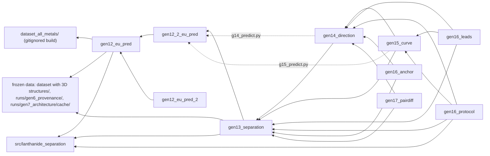

# generations/: gen12 onwards

Every generation from gen12 onwards has its own directory here, with its own library package,
scripts, results and reports. The ten directories sat at the repository root until 2026-09-13,
when commit 155dc6c moved them here as pure renames. Their names did not change.

gen2 to gen11 were never moved. Their code, tests and run artefacts are in `src/`, `scripts/`,
`tests/` and `runs/`, and they are indexed in [docs/README.md](../docs/README.md) and summarised in
[docs/HANDOFF_FOR_CHATGPT.md](../docs/HANDOFF_FOR_CHATGPT.md). For the repository as a whole, start
at the [top-level README](../README.md).

## Contents

- [The generations](#the-generations)
- [Guardrails that span generations](#guardrails-that-span-generations)
- [Layout inside a generation](#layout-inside-a-generation)
- [Dependencies between generations](#dependencies-between-generations)
- [Reading order for a newcomer](#reading-order-for-a-newcomer)
- [Provenance and the relocation record](#provenance-and-the-relocation-record)
- [Path convention](#path-convention)
- [Migrating a local clone](#migrating-a-local-clone)

## The generations

Status:

- **locked**: finished; its report is final and later generations cite it. Pre-registered where the
  table says so.
- **exploratory**: designed after results were seen, inside an otherwise locked generation.
- **unreviewed**: prior-session work committed without review in fdb1e15 (2026-09-10). No reviewed
  report depends on it.
- **superseded**: a draft replaced by another directory.

Every number below needs the regime it was measured in. BP is the publication-masked chemotype
hold-out; design B is the chemotype hold-out without that mask.

| Directory | Dates | Question | Verdict (one line) | Status | Entry document | Tests (from the repository root) |
|---|---|---|---|---|---|---|
| `gen12_eu_pred` | Pre-registered 2026-09-05; committed 2026-09-07 | Can structure plus conditions predict log D(Eu) for unseen extractants, zero-shot and with 1 to 5 measurements, and does training on other lanthanides help? | Zero-shot significantly beats only predict-the-mean. The edge over a conditions-only model is +0.086 [−0.025, +0.189] (design B, extractant-macro MAE). Few-shot passes (1.271 → 0.867 from k = 0 to 5, all of it in the level). Strict multi-lanthanide transfer is −0.003. | locked, pre-registered | [README.md](gen12_eu_pred/README.md), then [DECISION_REPORT.md](gen12_eu_pred/DECISION_REPORT.md) | `.venv/bin/python -m pytest generations/gen12_eu_pred/tests -q` |
| `gen12_2_eu_pred` | Pre-registered 2026-09-05; committed 2026-09-07 | Do 114 2D coordination-topology descriptors improve zero-shot prediction of an unseen extractant's intrinsic Eu level? | +0.060 over a bare ECFP fingerprint (p = 0.007). The pre-registered primary, over Gen12's full representation, is borderline: +0.034, p = 0.092. One measurement erases the difference. | locked, pre-registered | [README.md](gen12_2_eu_pred/README.md), then [DECISION_REPORT.md](gen12_2_eu_pred/DECISION_REPORT.md) | `.venv/bin/python -m pytest generations/gen12_2_eu_pred/tests -q` |
| `gen12_eu_pred_2` | Committed 2026-09-07 | None of its own: early code for Gen12.2's cohort bridge and five level definitions. | A four-module library with no scripts, tests or results. Cite `gen12_2_eu_pred` instead. | superseded draft | [README.md](gen12_eu_pred_2/README.md) | none (path check in `generations/tests/test_generations_relocation.py`) |
| `gen13_separation` | 2026-09-07 to 2026-09-08; committed 2026-09-09 | Can separation factors be predicted zero-shot from a low-rank lanthanide-axis curve, and does that beat the row-wise log D model? | The curve model ties the row model (P1 −0.006, p = 0.75, design B). "Conditions beat chemistry" was a publication fingerprint, which is why design BP exists. The lean bag scores 0.536 under BP. | locked, pre-registered (P1, S1–S6); stages 2–3 exploratory; wild-cluster inference files unreviewed | [README.md](gen13_separation/README.md), then [DECISION_REPORT.md](gen13_separation/DECISION_REPORT.md) | `.venv/bin/python -m pytest generations/gen13_separation/tests -q` |
| `gen14_direction` | 2026-09-09 | Can the curve be predicted as one direction bit, called from 39 donor-topology counts, times one constant magnitude? | Direction accuracy 0.821 against 0.768 for gen13's trees. Pairwise log SF MAE is 0.500 under BP and 0.491–0.500 across the five designs. The remaining error is the magnitude. | locked, not pre-registered; straw, permutation and capacity controls unreviewed | [GEN14_REPORT.md](gen14_direction/GEN14_REPORT.md) | none (anchor guarded by `generations/gen16_leads/tests/test_anchors.py`) |
| `gen15_curve` | 2026-09-09 | What is gen14 worth against predicting no separation, where is the remaining error, and how much do one to three measured pairs recover? | +0.088 over FLAT (0.589 → 0.500, BP, p = 0.047). An in-sample oracle is not a ceiling. One measured pair gives 0.231; three D-optimal pairs give 0.163–0.170. The model answers "which way", not "which ligand". | locked, not pre-registered; `scripts/g15_anchor.py` unreviewed | [GEN15_REPORT.md](gen15_curve/GEN15_REPORT.md) (orientation in [README.md](gen15_curve/README.md)) | none (anchors guarded by `generations/gen16_leads/tests/test_anchors.py`) |
| `gen16_anchor` | About 2026-09-09; committed 2026-09-10 | Does anchor regression with the publication as the anchor beat gen14 under BP? | Every anchor arm is worse than G14 (best 0.571 against 0.500, BP), and no contrast passes P1. No report. | unreviewed | [README.md](gen16_anchor/README.md), then [scripts/g16_anchor_fast.py](gen16_anchor/scripts/g16_anchor_fast.py) (docstring) | none |
| `gen16_leads` | 2026-09-09 to 2026-09-10 | Can six pre-registered leads, each refuted blind and confirmed on withheld seeds, find a valid positive result on the gen13 cohort? | One claim confirmed: gen14's direction call used as a between-laboratory screening filter saves +1.909 of 6.91 expected measurements (BP, withheld seeds). Within one publication it saves nothing. Every other lead closed. | locked, sealed pre-registration, one confirmation run | [DECISION_REPORT.md](gen16_leads/DECISION_REPORT.md) (brief in [START_HERE.md](gen16_leads/START_HERE.md)) | `.venv/bin/python -m pytest generations/gen16_leads/tests -q -m "not slow"` |
| `gen16_protocol` | About 2026-09-09; committed 2026-09-10 | Do the programme's statistics hold on its few clusters, and can a ligand's effect be separated from its laboratory's? | In simulation the percentile chemotype bootstrap rejects 7–8 % at nominal 5 %. Under a wild cluster bootstrap, G14 − FLAT has p = 0.0593. 75 of 82 well-determined extractants come from one publication. Two runs are incomplete. No report. | unreviewed | [README.md](gen16_protocol/README.md), then [scripts/](gen16_protocol/scripts/) (docstrings) | none |
| `gen17_pairdiff` | Run 2026-09-09; committed 2026-09-10 | Does learning within-publication differences in curve amplitude recover transferable signal? | Every arm is worse than predicting zero difference (leave-one-publication-out on 289 cells, not BP). | unreviewed | [README.md](gen17_pairdiff/README.md), then [results/g17_summary.txt](gen17_pairdiff/results/g17_summary.txt) | none |
| `gen19_chem_transfer` | 2026-09-13 to 2026-09-24 | Can unmeasured metal × extractant behaviour be reconstructed from structure shared across metals, extractants, mechanisms, conditions and publications — judged only under deliberately hidden chemistry (missing-cell V5, leave-metal V2, leave-publication V1) — with uncertainty carried into the gen18 process layer? | Discovery only (selection half, seed 104729, optimistically biased): the factorised M2 beats the within-system lookup B3i on hidden cells (Δ +0.263 ≥ δ5 0.106; R19 items 1, 2, 3, 5 PASS) but the descriptor CatBoost M0 is better still (M2 − M0 = −0.154), so the ladder keeps M0 and M3–M7 never run; F4 (negative actinide transfer) HOLDS on V2 under the conservative reading. **The confirmation run on the withheld seeds and the single Pr/Nd (V6) test were NOT RUN, so every full R19 verdict of a learned-arm contrast, and therefore S1 and S2, is UNDECIDED and no claim is confirmed.** | sealed pre-registration (2026-09-15) + 8 POST-HOC addenda; discovery, ladder, power check and H3 complete; confirmation NOT RUN; process step refused | [SUMMARY.md](gen19_chem_transfer/SUMMARY.md), then [GEN19_REPORT.md](gen19_chem_transfer/GEN19_REPORT.md) (orientation in [README.md](gen19_chem_transfer/README.md)) | `.venv/bin/python -m pytest generations/gen19_chem_transfer/tests -q -p no:cacheprovider` |

Cross-cutting tests for the 2026-09 move, not tied to one generation:

```bash
.venv/bin/python -m pytest generations/tests -q
```

`test_generations_relocation.py` checks the Gen12 and Gen12.2 manifests and the three gen12-family
`paths` modules. `test_generations_migrate.py` checks the clone migration script. No `PYTHONPATH` is
needed for any command in the table: each test module puts its own generation on `sys.path`, and
the `paths` modules add `src/`. The generation tests need the frozen bundle and the `runs/` caches.
The gen16 anchor tests build `generations/gen14_direction/cache/bench.pkl` on first load (gitignored).

## Guardrails that span generations

These are later corrections that change how earlier numbers read. Each generation's own report
lists the rest.

- **Select and quote under BP.** Without a publication mask, gen13's 64 condition columns identify
  a held-out cell's publication with 94 % 1-NN accuracy. Design-B numbers carry that fingerprint
  (gen13 §5a; gen16 guardrail 7). It was measured on separation factors and was not re-run on
  gen12's Eu log D.
- **FLAT is the floor, not MEAN_CURVE.** Under BP, the corpus mean curve (0.622) is worse than
  predicting no separation (0.589), so gains quoted against it overstate the value (gen15 §1).
- **An in-sample own-cell oracle is not a ceiling.** Own a and b score 0.1811 in sample and 0.2736
  leave-pair-out (gen15 §1a). Gen12's 0.334 and Gen12.2's 0.310 level oracles are the same kind of
  quantity.
- **Design B caps train similarity at 0.698.** A Tanimoto-0.7 single-linkage hold-out guarantees it,
  so "near" means 0.60 to 0.698. The near/mid/far bands are not a partition either: 52 of 183
  extractants fall in more than one (gen12.2 §5).
- **The percentile chemotype bootstrap may be anti-conservative.** Two unreviewed simulations give
  rejection rates of 0.07–0.08 at nominal 0.05 (`gen16_protocol/results/g16_size.log`,
  `gen13_separation/metrics/BP_all/inference_calibration.csv`). No reviewed report has adopted a
  replacement.

## Layout inside a generation

The pre-registered generations (gen12, gen12.2, gen13) share one layout:

```
<generation>/
  README.md              orientation, reading order, how to run
  DATA_AUDIT.md          cohort audit, written before any model was fitted
  PRE_REGISTRATION.md    frozen protocol; later addenda are dated
  DECISION_REPORT.md     results, defects, guardrails, recommendation
  <package>/             the library: gen12eu, gen122, gen13sep
  scripts/               one runner per phase
  tests/                 the pre-registered invariants, executable
  config/  manifests/  splits/  features/
  predictions/  metrics/  bootstrap/  headline_tables/  figures/  analysis/
```

Where a generation deviates:

| Directory | Deviation |
|---|---|
| `gen12_eu_pred` | No `features/` or `analysis/`. `models/` is empty: fitted models were not committed. |
| `gen12_2_eu_pred` | Adds `COORDINATION_DESCRIPTOR_SPEC.md` and `features/`. The frozen `features/coordination_descriptors.parquet` is read by gen13 onwards. |
| `gen12_eu_pred_2` | Only the package `gen12eu2/` plus a README. The empty output directories beside it are created when `gen12eu2/paths.py` is imported, and git does not track them. |
| `gen13_separation` | Stage reports live in [analysis/stage2/STAGE2_REPORT.md](gen13_separation/analysis/stage2/STAGE2_REPORT.md) and [analysis/stage3/STAGE3_REPORT.md](gen13_separation/analysis/stage3/STAGE3_REPORT.md). `models/*.joblib` and `predictions/**/*.parquet` are gitignored. |
| `gen14_direction` | The report is `GEN14_REPORT.md`. There is no DATA_AUDIT, PRE_REGISTRATION or `tests/`. Package `gen14/`; tables in `results/` ([results/TABLES.md](gen14_direction/results/TABLES.md)); `cache/` is gitignored. |
| `gen15_curve` | The report is `GEN15_REPORT.md`. There is no DATA_AUDIT, PRE_REGISTRATION or `tests/`. Package `gen15/`, boards in `results/`, and eight experiment arms in `exp/<arm>/`, some with their own report (for example [exp/decision/REPORT.md](gen15_curve/exp/decision/REPORT.md)). |
| `gen16_leads` | Brief-driven: `START_HERE.md`, sealed `PRE_REGISTRATION.md`, `STATUS.md`, `REFUTATION_LOG.md`, `CONFIRMATION.md`, `DECISION_REPORT.md`. Package `gen16/`; per-lead results in `results/<lead>/`; digests of large excluded artefacts in `results/MANIFEST.sha256`. |
| `gen16_anchor` | No report; `README.md` is the orientation. The first-version scripts and their CSVs sit at the top level; the exact fast path is in `scripts/` and writes to `results/`. |
| `gen16_protocol` | No report or tests: `README.md`, `gen16/`, `scripts/`, `results/`. Its package is also named `gen16`, like gen16_leads' package, so the two directories cannot share one `sys.path`. |
| `gen17_pairdiff` | Three top-level scripts, `results/` and a `README.md`; the only results write-up is `results/g17_summary.txt`. |
| `gen19_chem_transfer` | Brief-driven: `GEN19_CLAUDE_CODE_INSTRUCTIONS.md`, `DATA_AUDIT.md`, `FEASIBILITY.md`, sealed `preregistration.md` (eight POST-HOC addenda below the footer), `GEN19_REPORT.md`, `SUMMARY.md`, `decisions/D00–D07`. Package `gen19ct/`; runners in `scripts/`; per-fold records under `evaluation/<stage>/` are gitignored and digested in `evaluation/discovery/MANIFEST.sha256`; every stage's digests in `manifests/digest_registry.json`. |

## Dependencies between generations

Each generation imports or reads only earlier ones. Every edge below was checked with `git grep`
for `sys.path` inserts, `REPO_ROOT` / `ROOT` joins and imports.



The main chain, as text:

```
gen16_leads, gen16_protocol -> gen15_curve -> gen14_direction -> gen13_separation -> gen12_2_eu_pred -> gen12_eu_pred -> src/ and data
gen16_anchor, gen17_pairdiff -> gen14_direction -> gen13_separation
gen12_eu_pred_2 -> gen12_eu_pred
```

| Edge | Evidence |
|---|---|
| gen12_eu_pred → src/, data | `gen12eu/paths.py` puts `src/` on `sys.path` and reads `runs/gen7_architecture/cache/` (chemistry map, cohort), `runs/gen6_provenance/` and `dataset_all_metals/`, all from `REPO_ROOT` |
| gen12_2_eu_pred → gen12_eu_pred | `gen122/paths.py` puts `generations/gen12_eu_pred` on `sys.path`; the package imports `gen12eu` and reads Gen12's fold plan, predictions and manifest |
| gen12_eu_pred_2 → gen12_eu_pred | `gen12eu2/paths.py` puts it on `sys.path`; `gen12_bridge.py` imports `gen12eu` |
| gen13_separation → gen12_2_eu_pred | `gen13sep/paths.py` reads `features/coordination_descriptors.parquet`; `scripts/g13_predict.py` puts `gen12_2_eu_pred` and `gen12_eu_pred` on `sys.path` |
| gen13_separation → src/, data | `gen13sep/paths.py`: `SRC_ROOT`, the bundle, the gen7 chemistry map and the gen6 provenance table |
| gen14_direction → gen13_separation | `gen14/dirbench.py` puts `generations/gen13_separation` on `sys.path`; `scripts/g14_predict.py` also adds `gen12_2_eu_pred` for `gen122.coordination` |
| gen15_curve → gen14_direction, gen13_separation | `gen15/valuebench.py`; `scripts/g15_predict.py` imports `gen122.coordination` |
| gen16_leads → gen15, gen14, gen13 | `gen16/bootstrap.py` |
| gen16_protocol → gen15, gen14, gen13, src/ | `gen16/designs.py` (which also imports `lanthanide_separation.gen6.cohorts`); its scripts read gen13's `metrics/BP_all/per_extractant.csv` and gen14's `results/g14_value_per_extractant_BP.csv` |
| gen16_anchor → gen14, gen13 | `scripts/g16_anchor_fast.py` and `scripts/g16_anchor.py`; the remaining scripts hardcode the Windows clone root `D:\ml_separator_gh` |
| gen17_pairdiff → gen14, gen13 | `g17_within_pub_pairs.py` puts gen13 on `sys.path` and unpickles `generations/gen14_direction/cache/bench.pkl` (gitignored, built by `gen14.dirbench.load`) |

Every generation reaches `src/` and the frozen data at least through gen12eu or gen13sep. The only
places an earlier directory names a later one are comments: `gen14_direction/scripts/g14_value.py`
mentions gen16_protocol, and `gen16_leads/scripts/refute_l1null_B.py` states that it never touches
gen16_anchor, gen16_protocol or gen17_pairdiff.

## Reading order for a newcomer

1. [docs/HANDOFF_FOR_CHATGPT.md](../docs/HANDOFF_FOR_CHATGPT.md) for gen2–gen11. It was written on
   2026-09-03, so its gen11 section predates the matched stage; the current gen11 verdict is
   [runs/gen11_transfer/GEN11_DECISION_REPORT.md](../runs/gen11_transfer/GEN11_DECISION_REPORT.md).
2. gen12_eu_pred: [README](gen12_eu_pred/README.md), [DATA_AUDIT](gen12_eu_pred/DATA_AUDIT.md),
   [PRE_REGISTRATION](gen12_eu_pred/PRE_REGISTRATION.md), [DECISION_REPORT](gen12_eu_pred/DECISION_REPORT.md).
   It sets the regime vocabulary the later generations use.
3. gen12_2_eu_pred: [README](gen12_2_eu_pred/README.md), then [DECISION_REPORT](gen12_2_eu_pred/DECISION_REPORT.md)
   (§2 for the level bottleneck, §13 for the defects).
4. gen13_separation: [README](gen13_separation/README.md), then [DECISION_REPORT](gen13_separation/DECISION_REPORT.md),
   especially §5a (publication masking) and §9a (the direction of selectivity).
5. [gen14_direction/GEN14_REPORT.md](gen14_direction/GEN14_REPORT.md).
6. [gen15_curve/GEN15_REPORT.md](gen15_curve/GEN15_REPORT.md). Read §1 and §1a before quoting any oracle.
7. gen16_leads: [START_HERE](gen16_leads/START_HERE.md), [PRE_REGISTRATION](gen16_leads/PRE_REGISTRATION.md),
   [DECISION_REPORT](gen16_leads/DECISION_REPORT.md), [CONFIRMATION](gen16_leads/CONFIRMATION.md),
   [REFUTATION_LOG](gen16_leads/REFUTATION_LOG.md). This is the current state of the programme.
8. Only then the unreviewed directories: gen16_protocol, gen16_anchor, gen17_pairdiff. Read
   gen12_eu_pred_2 only for history.

## Provenance and the relocation record

**Sealed pre-registration.** [gen16_leads/PRE_REGISTRATION.md](gen16_leads/PRE_REGISTRATION.md) ends
with a two-line footer recording the SHA-256 of every byte above it:
`d004c30388078ae97232af2537a1915360360a7cb9eda07ebe4076764c48f50e`. Moving the file did not change its
bytes. To verify the seal (read-only without flags; never pass `--seal` or `--reseal`):

```bash
.venv/bin/python generations/gen16_leads/scripts/g16_prereg_hash.py     # prints OK recorded ... computed ...
```

**Manifests with per-file hashes.** [gen12_eu_pred/manifests/manifest.json](gen12_eu_pred/manifests/manifest.json)
(187 artefacts) and [gen12_2_eu_pred/manifests/manifest.json](gen12_2_eu_pred/manifests/manifest.json)
(227 artefacts) record a size and hash for nearly every file in those directories, code included,
under the key `artefacts`. gen16_leads keeps digests of its large gitignored artefacts in
`gen16_leads/results/MANIFEST.sha256` (`generations/gen16_leads/scripts/g16_manifest.py --check`).
JSON, CSV and parquet result files and manifests are historical records. Some contain pre-move
paths; they are never rewritten.

**Why the move needed a relocation record.** Moving gen12_eu_pred and gen12_2_eu_pred one level
down changed what `Path(__file__).parents[...]` resolves to. Four manifest-listed files had to
change. In `gen12eu/paths.py` and `gen122/paths.py`, `REPO_ROOT` gains one `.parent` and Gen12.2's
`GEN12_ROOT` gains `generations/`, so every computed path keeps its pre-move target.
`gen12_2_eu_pred/scripts/g122_self_audit.py` and `gen12_eu_pred/scripts/gen12_manifest.py` (its
`--verify`) now undo the recorded substitutions before comparing hashes. Rewriting the manifests would
destroy the record they exist to keep, and leaving the edits unrecorded would make them
indistinguishable from drift. Instead:

- [RELOCATION.json](RELOCATION.json) records each edit as an exact text substitution (`before` and
  `after`), with the reason. It stores no hashes.
- [verify_relocation.py](verify_relocation.py) undoes those substitutions and checks the result
  against the hashes it reads live from the manifests. It hashes every other listed file as it
  stands. Drift that already existed at the pre-move commit fdb1e15 is reported but does not fail.
  Its `original_bytes(path)` is what `g122_self_audit.py`, `gen12_manifest.py --verify` and
  `gen12eu2.paths.assert_gen12_untouched()` now hash.

```bash
.venv/bin/python generations/verify_relocation.py      # standard library only; exit 0 and "RESULT: PASS"
```

`gen12_manifest.py --verify` also undoes the recorded substitutions before comparing. Running it
without `--verify` (directly or via `gen12_finalise.sh`) re-stamps the frozen manifest with post-move
bytes, and `verify_relocation.py` will then fail.

## Path convention

- **Reports cite paths relative to `generations/`.** Reports, status logs and result files were
  written while these directories sat at the repository root. A path cited in prose, such as
  `gen13_separation/headline_tables/t1_leaderboard.md`, therefore means
  `generations/gen13_separation/headline_tables/t1_leaderboard.md`. Those citations were
  deliberately left as written.
- **Scripts are run from the repository root**, as
  `.venv/bin/python generations/<generation>/scripts/<script>.py`. Several scripts use
  cwd-relative paths and fail from anywhere else (for example `gen14_direction/scripts/g14_tables.py`
  and `gen17_pairdiff/g17_sibling_anchor.py`).
- **Interpreter.** Docstrings written on the Windows clone show `.venv/Scripts/python.exe`; on macOS
  or Linux use `.venv/bin/python`. Hardcoded `D:/ml_separator_gh/...` roots in gen16_anchor target
  that Windows clone.
- **Running a script rewrites committed results.** Most experiment and analysis scripts write
  tracked boards, contrast CSVs or reports. Copy what you need before re-running anything.

## Migrating a local clone

Pulling commit 155dc6c moves every tracked file, but git leaves ignored files where they were.
Fitted model blobs, prediction dumps, the gen14 bench cache, gen15's derived tables and
`gen16_anchor/pairs_BP.pkl` stay under the old root directories (`<root>/gen13_separation/...`),
where no script reads them any more. The legacy block at the end of [.gitignore](../.gitignore)
keeps them ignored so they cannot become committable by accident.
[migrate_local_artifacts.py](migrate_local_artifacts.py) moves them to their new locations.

Run it from the repository root, dry run first:

```bash
.venv/bin/python generations/migrate_local_artifacts.py                          # dry run: report only
.venv/bin/python generations/migrate_local_artifacts.py --apply                  # act
.venv/bin/python generations/migrate_local_artifacts.py --apply --include-untracked
```

On Windows: `.venv\Scripts\python.exe generations\migrate_local_artifacts.py --apply`.

It finds the repository root from its own location and uses only the standard library and the
`git` command line. For each of the ten generation names whose old directory still exists, it
classifies every file:

| Report | File | Action with `--apply` |
|---|---|---|
| `MOVE` | ignored; destination `generations/<name>/<same path>` is free | moved |
| `DUPLICATE` | ignored; destination holds identical bytes | old copy deleted |
| `CONFLICT` | ignored; destination holds different content | nothing: both copies kept |
| `REGEN` | ignored tool cache (`__pycache__`, `.pytest_cache`, `.ruff_cache`, `.mypy_cache`, `.DS_Store`) | deleted, never moved, never a conflict |
| `UNTRACKED` | untracked and not ignored, possibly your own work | nothing, unless `--include-untracked` (then treated as ignored) |
| `TRACKED` | still tracked by git at the old path, which is unexpected after the move | nothing |
| `RMDIR` | a directory left empty under an old generation directory | removed |

Without `--apply` nothing changes. The exit status is 1 if there was at least one conflict (in a
dry run too), 2 if git cannot inspect the repository, and 0 otherwise. Resolve each conflict by
keeping one copy and deleting the other, then run again until it exits 0. Once every clone has been
migrated, the legacy block in `.gitignore` can go. Tests:
`.venv/bin/python -m pytest generations/tests/test_generations_migrate.py -q`.
